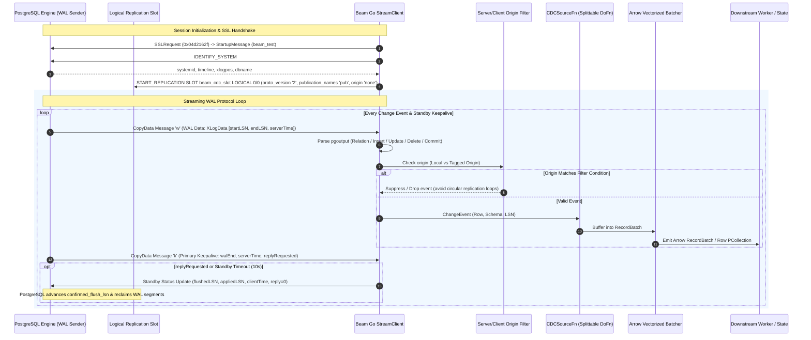
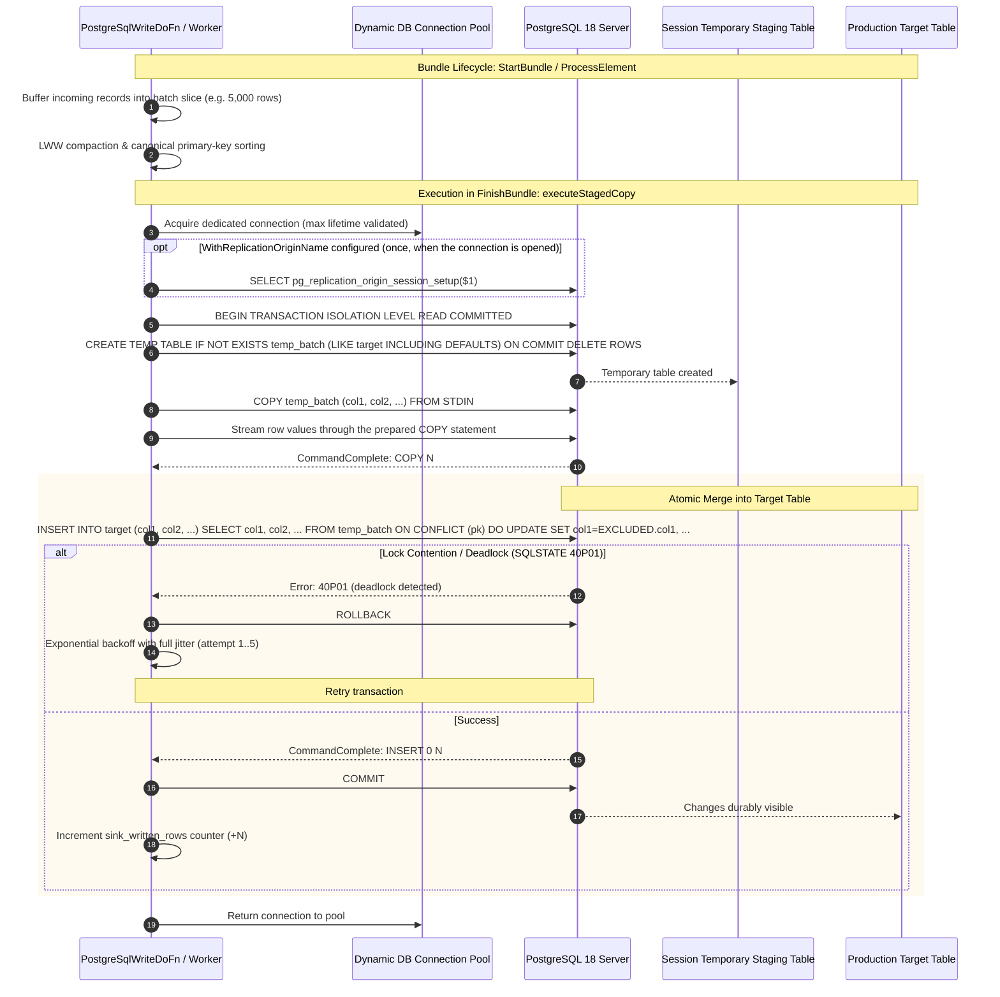

<!--
    Licensed to the Apache Software Foundation (ASF) under one
    or more contributor license agreements.  See the NOTICE file
    distributed with this work for additional information
    regarding copyright ownership.  The ASF licenses this file
    to you under the Apache License, Version 2.0 (the
    "License"); you may not use this file except in compliance
    with the License.  You may obtain a copy of the License at

      http://www.apache.org/licenses/LICENSE-2.0

    Unless required by applicable law or agreed to in writing,
    software distributed under the License is distributed on an
    "AS IS" BASIS, WITHOUT WARRANTIES OR CONDITIONS OF ANY
    KIND, either express or implied.  See the License for the
    specific language governing permissions and limitations
    under the License.
-->

# Contributing to Apache Beam Go `postgresio`

This guide details the system architecture, design invariants, cross-language expansion conventions, and testing protocols for contributors to the Apache Beam Go PostgreSQL I/O connector (`postgresio`).

---

## 1. System Architecture & Lifecycle Diagrams

The Go PostgreSQL connector provides two decoupled runtime engines:
1. **Streaming CDC Engine**: Direct logical replication slot consumer decoding `pgoutput` records into Arrow micro-batches and Beam schemas.
2. **Staged COPY Upsert Engine**: Session-scoped staging tables loaded with `COPY ... FROM STDIN`, then applied to the target with an atomic `ON CONFLICT` merge.

### 1.1 Native CDC Streaming Architecture & LSN Standby Feedback Loop



### 1.2 High-Throughput Staged COPY Upsert Engine



---

## 2. Cross-Language SchemaTransform Architecture

Apache Beam provides cross-language schema transform compatibility so that pipelines authored in Python, YAML, or Java can transparently invoke the Go PostgreSQL I/O transforms:

| Transform | Standard URN | Go Registration | Schema Config Struct |
| :--- | :--- | :--- | :--- |
| **Bounded Batch Read** | `beam:schematransform:org.apache.beam:postgres_read:v1` | `schematransform.GlobalRegisterTyped[PostgreSqlReadConfig]` | `PostgreSqlReadConfig` |
| **Streaming CDC Read** | `beam:schematransform:org.apache.beam:postgres_read_cdc:v1` | `schematransform.GlobalRegisterTyped[PostgreSqlReadCDCConfig]` | `PostgreSqlReadCDCConfig` |
| **Write Sink** | `beam:schematransform:org.apache.beam:postgres_write:v1` | `schematransform.GlobalRegisterTyped[PostgreSqlWriteConfig]` | `PostgreSqlWriteConfig` |

### Configuration Fields Schema

```go
type PostgreSqlReadConfig struct {
    Location        string `beam:"location"`
    ReadQuery       string `beam:"read_query"`
    JdbcUrl         string `beam:"jdbc_url"`
    Host            string `beam:"host"`
    Port            int32  `beam:"port"`
    Database        string `beam:"database"`
    Table           string `beam:"table"`
    Query           string `beam:"query"`
    Username        string `beam:"username"`
    Password        string `beam:"password,secret"`
    PasswordEnvVar  string `beam:"password_env_var"`
    SSLMode         string `beam:"sslmode"`
    SSLRootCert     string `beam:"sslrootcert"`
    FetchSize       int32  `beam:"fetch_size"`
    PartitionColumn string `beam:"partition_column"`
    NumPartitions   int32  `beam:"num_partitions"`
    LowerBound      *int64 `beam:"lower_bound"`
    UpperBound      *int64 `beam:"upper_bound"`
}
```

```go
type PostgreSqlWriteConfig struct {
    Host                  string   `beam:"host"`
    Port                  int32    `beam:"port"`
    Database              string   `beam:"database"`
    Table                 string   `beam:"table"`
    Username              string   `beam:"username"`
    Password              string   `beam:"password,secret"`
    PasswordEnvVar        string   `beam:"password_env_var"`
    SSLMode               string   `beam:"sslmode"`
    SSLRootCert           string   `beam:"sslrootcert"`
    ConflictKeys          []string `beam:"conflict_keys"`
    UpdateFields          []string `beam:"update_fields"`
    MaxBatchRows          int32    `beam:"max_batch_rows"`
    MaxBatchBytes         int32    `beam:"max_batch_bytes"`
    UsePgBouncer          bool     `beam:"use_pgbouncer"`
    ReplicationOrigin     string   `beam:"replication_origin"`
    WriteMode             string   `beam:"write_mode"`
    OpColumn              string   `beam:"op_column"`
    DeleteOpValue         string   `beam:"delete_op_value"`
    ExplainAnalyze        bool     `beam:"explain_analyze"`
}
```

```go
type PostgreSqlReadCDCConfig struct {
    Host              string                   `beam:"host"`
    Port              int32                    `beam:"port"`
    Database          string                   `beam:"database"`
    SlotName          string                   `beam:"slot_name"`
    Publication       string                   `beam:"publication"`
    Username          string                   `beam:"username"`
    Password          string                   `beam:"password,secret"`
    PasswordEnvVar    string                   `beam:"password_env_var"`
    SSLMode           string                   `beam:"sslmode"`
    SSLRootCert       string                   `beam:"sslrootcert"`
    Tables            []string                 `beam:"tables"`
    OriginFilter      string                   `beam:"origin_filter"`
    OutputFormat      string                   `beam:"output_format"`
    ArrowBatchRows    int32                    `beam:"arrow_batch_rows"`
    ProtoVersion      int32                    `beam:"proto_version"`
    BinaryMode        *bool                    `beam:"binary_mode"`
    StreamingMode     string                   `beam:"streaming_mode"`
    FailoverSlot      bool                     `beam:"failover_slot"`
    PublicationTables []PublicationTableConfig `beam:"publication_tables"`
}
```

---

## 3. Engineering Invariants & Coding Guidelines

1. **Pure Go Without JNI or JVM Wrappers**:
   The Go connector is completely self-contained (`CGO_ENABLED=0` invariant). It does not require a Java runtime or expansion service for native Go pipelines.
2. **Zero-Allocation Hot Paths**:
   Per-row processing in logical decoding loops must avoid heap allocations. Reusable byte buffers, slice pooling, and zero-allocation Arrow builders must be maintained.
3. **Upstream Database Guardrails**:
   * Single-consumer restriction: Exactly one Splittable DoFn worker connects to a physical replication slot (`Parallelism = 1` at the slot boundary).
   * Connection pool bounding: `WriteOptions.MaxConnections` defaults to 2 per worker to eliminate connection exhaustion under large worker autoscaling.
   * Last-Write-Wins (LWW) compaction & primary key sorting: Prevents duplicate updates and mitigates PostgreSQL `40P01` deadlock errors on concurrent batches, backed by an exponential backoff retry loop as the primary safety net.
   * Dynamic IAM Token Expiration: Pooled connections enforce token lifetime limits to renew short-lived cloud credentials before socket expiration.
4. **Factual and Objective Tone**:
   Documentation, code comments, commit messages, and PR descriptions must remain strictly factual, describing concrete engineering behaviors, algorithms, and latency/throughput metrics without promotional modifiers.

---

## 4. Local Development & Testing

### Prerequisites
* Go 1.21 or higher
* Docker or native PostgreSQL 15–18
* Git

### Unit & Integration Testing
```bash
# Run all unit tests with data race detector
go test -v -race ./pkg/beam/io/postgresio/...

# Run targeted benchmark tests
go test -run XXX -bench=BenchmarkArrowBatching -benchmem ./pkg/beam/io/postgresio/
```

### Test Suite Layout

Every test file in the package is part of the default `go test ./...` run.
There are no build-tagged suites.

| File | Purpose |
| :--- | :--- |
| `cdc_invariants_test.go` | Locks in guarantees that already hold: injection-resistant identifier sanitization, slot and heartbeat validation, credential redaction, batch compaction and deadlock-avoiding sort, key determinism. A failure means a change broke an existing guarantee. |
| `cdc_acceptance_test.go` | Regression guards for the defects that have been fixed. Hermetic: wire-level tests over `net.Pipe`, behavioral tests, and source-level guards for defects no behavioral test can reach. |

> [!IMPORTANT]
> Do not weaken or delete an acceptance test to get a green run. Several of these guard defects that affect the source database, not just the pipeline.

If you fix a defect listed in the README's Known Limitations table, add its regression guard to `cdc_acceptance_test.go` in the same pull request and update that table.

### Verification Checklist Before Submitting PR
- [ ] `go test -v -race ./...` passes with zero race detector warnings.
- [ ] `cdc_invariants_test.go` still passes; no assertion in it was relaxed.
- [ ] Any newly fixed defect has a regression guard in `cdc_acceptance_test.go` and the README Known Limitations table is updated.
- [ ] Code is formatted with `gofmt -s -w .`.
- [ ] Zero personal usernames or credentials in repository code, tests, docs, or roles (use `beam_navigator`, `scotty`, or `beam_transporter` exclusively).
- [ ] Apache 2.0 license header is present on every newly created file.
- [ ] Conformance tests pass against PostgreSQL 15, 16, 17, and 18.
- [ ] Arrow batcher allocations remain at 0 allocs/op for the hot decoding path.
