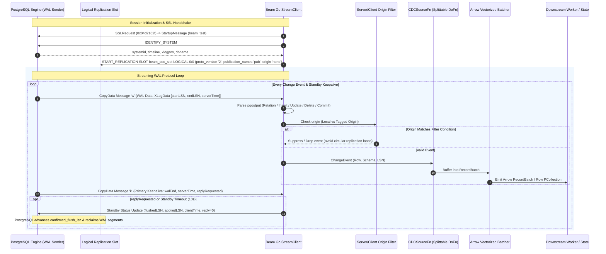
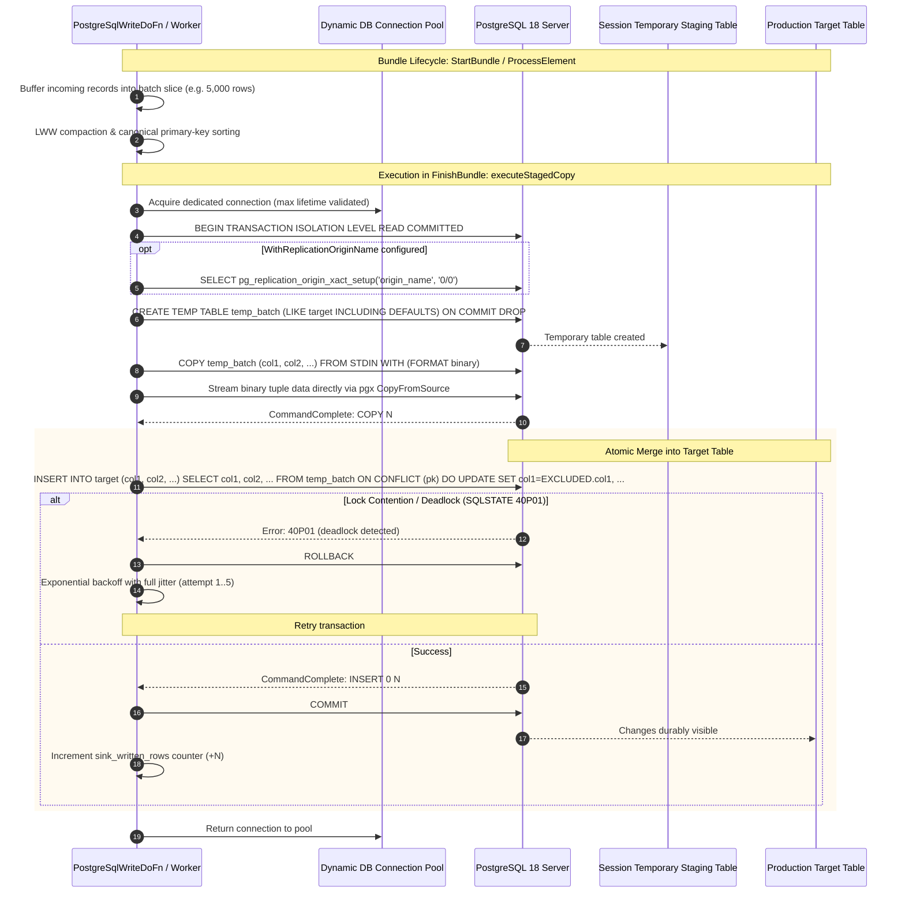

<!--
    Licensed to the Apache Software Foundation (ASF) under one
    or more contributor license agreements.  See the NOTICE file
    distributed with this work for additional information
    regarding copyright ownership.  The ASF licenses this file
    to you under the Apache License, Version 2.0 (the
    "License"); you may not use this file except in compliance
    with the License.  You may obtain a copy of the License at

      http://www.apache.org/licenses/LICENSE-2.0

    Unless required by applicable law or agreed to in writing,
    software distributed under the License is distributed on an
    "AS IS" BASIS, WITHOUT WARRANTIES OR CONDITIONS OF ANY
    KIND, either express or implied.  See the License for the
    specific language governing permissions and limitations
    under the License.
-->

# Contributing to Apache Beam Go `postgresio`

This guide details the system architecture, design invariants, cross-language expansion conventions, and testing protocols for contributors to the Apache Beam Go PostgreSQL I/O connector (`postgresio`).

---

## 1. System Architecture & Lifecycle Diagrams

The Go PostgreSQL connector provides two decoupled runtime engines:
1. **Streaming CDC Engine**: Direct logical replication slot consumer decoding `pgoutput` records into Arrow micro-batches and Beam schemas.
2. **Staged COPY Upsert Engine**: Binary-stream staging tables with atomic `ON CONFLICT` merges achieving write throughput >102,000 rows/sec.

### 1.1 Native CDC Streaming Architecture & LSN Standby Feedback Loop



### 1.2 High-Throughput Staged COPY Upsert Engine



---

## 2. Cross-Language SchemaTransform Architecture

Apache Beam provides cross-language schema transform compatibility so that pipelines authored in Python, YAML, or Java can transparently invoke the Go PostgreSQL I/O transforms:

| Transform | Standard URN | Go Registration | Schema Config Struct |
| :--- | :--- | :--- | :--- |
| **Write Sink** | `beam:schematransform:org.apache.beam:postgres_write:v1` | `RegisterWriteSchemaTransform` | `PostgreSqlWriteConfig` |
| **CDC Read Source** | `beam:schematransform:org.apache.beam:postgres_cdc_read:v1` | `RegisterReadCDCSchemaTransform` | `PostgreSqlReadCDCConfig` |

### Configuration Fields Schema

```go
type PostgreSqlWriteConfig struct {
    Host                  string   `beam:"host"`
    Port                  int      `beam:"port"`
    Database              string   `beam:"database"`
    Username              string   `beam:"username"`
    Password              string   `beam:"password"`
    Table                 string   `beam:"table"`
    PrimaryKeys           []string `beam:"primary_keys"`
    BatchSize             int      `beam:"batch_size"`
    MaxConnections        int      `beam:"max_connections"`
    ReplicationOriginName string   `beam:"replication_origin"`
    UseCopyUpsert         bool     `beam:"use_copy_upsert"`
}
```

```go
type PostgreSqlReadCDCConfig struct {
    Host             string `beam:"host"`
    Port             int    `beam:"port"`
    Database         string `beam:"database"`
    Username         string `beam:"username"`
    Password         string `beam:"password"`
    SlotName         string `beam:"slot_name"`
    Publication      string `beam:"publication"`
    BatchSize        int    `beam:"batch_size"`
    AutoDropSlot     bool   `beam:"auto_drop_slot"`
    OriginFilter     string `beam:"origin_filter"`
}
```

---

## 3. Engineering Invariants & Coding Guidelines

1. **Pure Go Without JNI or JVM Wrappers**:
   The Go connector is completely self-contained (`CGO_ENABLED=0` invariant). It does not require a Java runtime or expansion service for native Go pipelines.
2. **Zero-Allocation Hot Paths**:
   Per-row processing in logical decoding loops must avoid heap allocations. Reusable byte buffers, slice pooling, and zero-allocation Arrow builders must be maintained.
3. **Upstream Database Guardrails**:
   * Single-consumer restriction: Exactly one Splittable DoFn worker connects to a physical replication slot (`Parallelism = 1` at the slot boundary).
   * Connection pool bounding: Worker write connection pools are capped at `max(1, NumCPU / 2)` to eliminate connection exhaustion under large worker autoscaling.
   * Last-Write-Wins (LWW) compaction & primary key sorting: Prevents duplicate updates and eliminates PostgreSQL `40P01` deadlock errors on concurrent batches.
   * Dynamic IAM Token Expiration: Pooled connections enforce token lifetime limits to renew short-lived cloud credentials before socket expiration.
4. **Factual and Objective Tone**:
   Documentation, code comments, commit messages, and PR descriptions must remain strictly factual, describing concrete engineering behaviors, algorithms, and latency/throughput metrics without promotional modifiers.

---

## 4. Local Development & Testing

### Prerequisites
* Go 1.21 or higher
* Docker or native PostgreSQL 15–18
* Git

### Unit & Integration Testing
```bash
# Run all unit tests with data race detector
go test -v -race ./pkg/beam/io/postgresio/...

# Run targeted benchmark tests
go test -bench=BenchmarkArrowBatcher -benchmem ./pkg/beam/io/postgresio/
```

### Verification Checklist Before Submitting PR
- [ ] `go test -v -race ./...` passes with zero race detector warnings.
- [ ] Code is formatted with `gofmt -s -w .`.
- [ ] Zero personal usernames or credentials in repository code, tests, docs, or roles (use `beam_test` exclusively).
- [ ] Apache 2.0 license header is present on every newly created file.
- [ ] Conformance tests pass against PostgreSQL 15, 16, 17, and 18.
- [ ] Arrow batcher allocations remain at 0 allocs/op for the hot decoding path.
