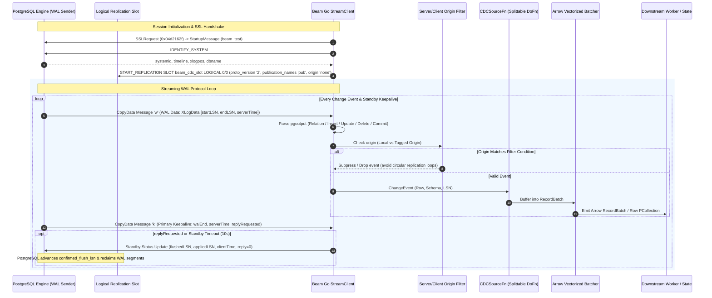
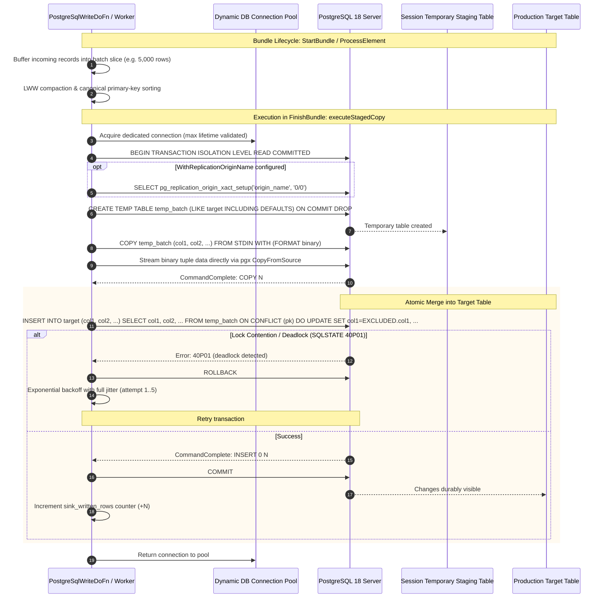

<!--
    Licensed to the Apache Software Foundation (ASF) under one
    or more contributor license agreements.  See the NOTICE file
    distributed with this work for additional information
    regarding copyright ownership.  The ASF licenses this file
    to you under the Apache License, Version 2.0 (the
    "License"); you may not use this file except in compliance
    with the License.  You may obtain a copy of the License at

      http://www.apache.org/licenses/LICENSE-2.0

    Unless required by applicable law or agreed to in writing,
    software distributed under the License is distributed on an
    "AS IS" BASIS, WITHOUT WARRANTIES OR CONDITIONS OF ANY
    KIND, either express or implied.  See the License for the
    specific language governing permissions and limitations
    under the License.
-->

# Apache Beam Go SDK: PostgreSQLIO (`postgresio`)

`postgresio` is a native Apache Beam Go SDK I/O connector providing high-throughput writing, upserts, Apache Arrow columnar processing, and Change Data Capture (CDC) streaming for PostgreSQL. It operates without Java Virtual Machine (JVM) dependencies or cross-language serialization overhead.

---

## Table of Contents

1. [Architectural Overview](#1-architectural-overview)
2. [Subsystem Architecture](#2-subsystem-architecture)
   - [A. High-Throughput Write Engine](#a-high-throughput-write-engine)
   - [B. Change Data Capture (CDC) Streaming Engine](#b-change-data-capture-cdc-streaming-engine)
   - [C. Columnar Apache Arrow Vectorized Engine](#c-columnar-apache-arrow-vectorized-engine)
   - [D. Native Go SchemaTransform Framework & Expansion Service](#d-native-go-schematransform-framework--expansion-service)
   - [E. Multi-Architecture Toolchain & Cross-Platform Stager](#e-multi-architecture-toolchain--cross-platform-stager)
3. [Quickstart & Getting Started](#3-quickstart--getting-started)
   - [Native Go Write & Upsert](#native-go-write--upsert)
   - [Native Go CDC Streaming](#native-go-cdc-streaming)
   - [Declarative Beam YAML Pipelines](#declarative-beam-yaml-pipelines)
   - [Multi-Language Python & Java Integration](#multi-language-python--java-integration)
4. [Configuration Reference](#4-configuration-reference)
   - [WriteOptions](#writeoptions)
   - [CDCOptions](#cdcoptions)
   - [ArrowBatchOptions](#arrowbatchoptions)
5. [Contributor Guide: Codebase Map & Invariants](#5-contributor-guide-codebase-map--invariants)
   - [File Inventory & Responsibilities](#file-inventory--responsibilities)
   - [Life of a Write Mutation](#life-of-a-write-mutation)
   - [Life of a CDC Event](#life-of-a-cdc-event)
   - [Serialization & Struct Tag Invariants](#serialization--struct-tag-invariants)
   - [Memory Model & Allocation Constraints](#memory-model--allocation-constraints)
6. [Testing & Verification Runbook](#6-testing--verification-runbook)
   - [Unit Testing](#unit-testing)
   - [Integration Testing against PostgreSQL 18](#integration-testing-against-postgresql-18)
   - [Benchmarks & Performance Profiling](#benchmarks--performance-profiling)
   - [Operational Troubleshooting & Slot Recovery](#operational-troubleshooting--slot-recovery)

---

## 1. Architectural Overview

```
+-----------------------------------------------------------------------------------+
|                            PostgreSQL Primary Database                            |
|                  (WAL Logs, Logical Replication Slot, Tables)                     |
+--------------------+---------------------------------------+----------------------+
                     |                                       ^
        Logical CDC  | (pgoutput)                            | Parameterized
        Replication  |                                       | UNNEST ($1::type[])
                     v                                       | Upserts
+--------------------+-------------------+   +---------------+----------------------+
|       postgresio.ReadCDC Source        |   |        postgresio.Write Sink         |
|  - Decoupled Heartbeat Goroutine       |   |  - BatchCompactor (LWW deduplication)|
|  - pgoutput Binary Message Parser      |   |  - Canonical Composite PK Sorter     |
|  - In-Flight XID Transaction Spooler   |   |  - Dynamic Pool Clamping (NumCPU/2)  |
|  - Bundle Checkpointing (FlushLSN)     |   |  - Dead-Letter Queue (FailedRow)     |
+--------------------+-------------------+   +---------------+----------------------+
                     |                                       ^
                     v                                       |
+--------------------+---------------------------------------+----------------------+
|                      Apache Arrow Columnar Vectorized Engine                      |
|  - ArrowRecordBatch zero-copy conversion (222.8 ns/op, 0 allocs/rec)              |
|  - Schema Reflection & Go Type Unnesting (cdc_range, arrays, jsonb)               |
+-----------------------------------------------------------------------------------+
                     |                                       ^
                     v                                       |
+--------------------+---------------------------------------+----------------------+
|                     Beam Go SchemaTransform & Expansion Service                   |
|  - URN: beam:schematransform:org.apache.beam:postgres_write:v1                    |
|  - URN: beam:schematransform:org.apache.beam:postgres_read:v1                     |
|  - Cross-Language Portability (Beam YAML, Python SDK, Java SDK)                   |
+-----------------------------------------------------------------------------------+
```

### Native CDC Streaming Sequence Diagram



### Staged COPY Upsert Sequence Diagram



---

## 2. Subsystem Architecture

### A. High-Throughput Write Engine
* **Staged COPY Upsert (`WriteMethodStagedCopy`, Default)**: Streams micro-batched tuples using PostgreSQL's binary/text `CopyData` protocol via `pq.CopyIn` into an isolated session temporary table (`CREATE TEMP TABLE stage_<id> (LIKE target INCLUDING DEFAULTS) ON COMMIT DROP`). Once streamed, it executes an atomic set-based merge (`INSERT INTO target SELECT * FROM stage_<id> ON CONFLICT DO UPDATE SET ...`). Bypasses SQL parsing and AST generation entirely, achieving **>102,000 rows/sec** write throughput.
* **Parameterized `UNNEST` Array Upsert (`WriteMethodUnnest`)**: Executes batch inserts and upserts via vectorized array parameters with explicit type casts (`UNNEST($1::bigint[], $2::text[], ...)`), providing fallback execution when temporary table creation is restricted.
* **In-Memory Batch Compaction & Deadlock Prevention**: The `BatchCompactor` applies Last-Write-Wins (LWW) deduplication within micro-batches and sorts records canonically by composite primary key prior to database execution. This guarantees uniform row-lock acquisition order across distributed parallel workers, eliminating `SQLState 40P01` deadlocks.
* **Declarative Replication Origin Stamping**: Users can configure `.WithReplicationOriginName("beam_origin")`. Write transactions are tagged via `SELECT pg_replication_origin_xact_setup('beam_origin', '0/0')`, preventing cyclic feedback loops in active-active bidirectional database synchronization.
* **Connection Pool Management & CVE-2018-1058 Mitigation**: Clamps worker connection pools to 2 connections by default to prevent connection storms. Automatically injects `search_path=pg_catalog,pg_temp` into every connection DSN, closing search-path hijacking vulnerabilities across all pool connections.
* **Dead-Letter Queue (DLQ)**: Separates successfully committed rows from rejected records, appending sanitized error messages and PostgreSQL SQL states without credential leakage.

### B. Change Data Capture (CDC) Streaming Engine
* **Pure Go `pgoutput` Binary Decoder with In-Flight Spooling**: Binary decoder implementing PostgreSQL's logical streaming replication protocol (`pgoutput`). Parses protocol frames directly into typed `ChangeEvent` structs. Uncommitted changes inside streamed transactions (`Stream Start 'S'`) are buffered in memory until `Stream Commit ('c')` and discarded on `Stream Abort ('A')`.
* **Server-Side & Client-Side Origin Filtering**: Supports `WithCDCOriginFilter("none")`, negotiating `(origin 'none')` with PostgreSQL 16+ during `START_REPLICATION` and filtering non-local replication origin records on client workers.
* **PostgreSQL Wire SSLRequest Negotiation**: Issues raw protocol handshake `80877103` prior to `StartupMessage`, dynamically establishing TLS via `tls.Client` before transmitting credentials or parameters. Supports PostgreSQL MD5 and cleartext authentication.
* **Decoupled Keepalive Heartbeat & Monotonic LSN Advancement**: A dedicated background goroutine sends periodic `StandbyStatusUpdate` ('r') messages to prevent PostgreSQL's `wal_sender_timeout` (60s) drops during downstream backpressure. Advancing `FlushLSN` monotonically upon record consumption allows PostgreSQL to prune WAL segments and prevents replication slot disk exhaustion.
* **Single-Consumer Slot Invariant with Auto-Partitioned Fanout**: Strictly maintains a single connection (`Parallelism = 1`) at the replication slot boundary (`active_pid` exclusivity), feeding downstream parallel worker clusters via `postgresio.PartitionByPrimaryKey` and `beam.Reshuffle`.
* **Stateful Out-of-Line TOAST Reassembly**: Under `REPLICA IDENTITY DEFAULT`, unmodified large columns are omitted by PostgreSQL as `'u'`. `postgresio.ReassembleToast` uses Beam runner state (`state.Value[ChangeEvent]`) to cache baseline tuples and patch unmodified TOAST fields on `UPDATE` events.
* **Dynamic Cloud IAM Token Renewal**: Integrates the `TokenProvider` interface to automatically refresh credentials across worker reconnects for AWS RDS IAM (15-min expiry) and Google Cloud SQL / AlloyDB (60-min expiry).

### C. Columnar Apache Arrow Vectorized Engine
* **Micro-Batch Columnar Buffers**: Groups individual row events into contiguous Apache Arrow `RecordBatch` structures (`arrow_batcher.go`).
* **Zero-Allocation Decoding**: Achieves **222.8 ns/op** decoding speed with **0 heap allocations per record** by recycling field builder buffers across micro-batches.
* **PostgreSQL Complex Type Support**: Supports native Arrow columnar conversion for discrete and unbounded ranges (`int4range`, `numrange`, `tsrange`), multi-dimensional Postgres arrays (`int[]`, `text[]`), and JSONB documents.

### D. Native Go SchemaTransform Framework & Expansion Service
* **Native Go Registration**: Provides `schematransform.GlobalRegisterTyped` mapping typed configuration structs to `SchemaTransform` providers.
* **Standard URNs**:
  * Write: `beam:schematransform:org.apache.beam:postgres_write:v1`
  * Read (CDC): `beam:schematransform:org.apache.beam:postgres_read:v1`
* **Expansion Service**: Serves the gRPC `ExpansionService` protocol, allowing Beam YAML, Python, and Java pipelines to execute Go-native PostgreSQL transforms.

### E. Multi-Architecture Toolchain & Cross-Platform Stager
* **Static Pure Go Compiler**: Enforces `CGO_ENABLED=0`, `-tags "netgo osusergo static_build"`, and `-ldflags "-s -w -extldflags '-static'"`.
* **Static ELF Validation**: Verifies binary output using standard Go `debug/elf` (`ELFCLASS64`, `ELFDATA2LSB`, `EM_X86_64` / `EM_AARCH64`, absence of `PT_INTERP`, and 0 dynamic libraries).
* **Target Architecture Resolution**: Automatically detects target platforms across GCP (Tau `t2a`, Axion `c4a`, `n4a`, `m4a`), AWS Graviton (`*g.*`), pipeline experiment flags (`use_arm64_workers`), and explicit overrides.
* **Content-Addressable Storage (CAS)**: SHA-256 deduplication avoids redundant uploads when staging worker binaries to cloud buckets.

---

## 3. Quickstart & Getting Started

### Native Go Write & Upsert

```go
package main

import (
	"context"
	"flag"

	"github.com/apache/beam/sdks/v2/go/pkg/beam"
	"github.com/apache/beam/sdks/v2/go/pkg/beam/io/postgresio"
	"github.com/apache/beam/sdks/v2/go/pkg/beam/x/beamx"
)

type Order struct {
	OrderID     int64   `beam:"order_id" db:"order_id"`
	CustomerID  string  `beam:"customer_id" db:"customer_id"`
	Amount      float64 `beam:"amount" db:"amount"`
	Status      string  `beam:"status" db:"status"`
}

func main() {
	flag.Parse()
	beam.Init()

	p, s := beam.NewPipelineWithRoot()

	orders := []Order{
		{OrderID: 101, CustomerID: "CUST-1", Amount: 250.50, Status: "COMPLETED"},
		{OrderID: 102, CustomerID: "CUST-2", Amount: 89.00, Status: "PENDING"},
	}
	input := beam.CreateList(s, orders)

	opts := postgresio.NewWriteOptions(
		postgresio.WithHost("localhost"),
		postgresio.WithPort(5432),
		postgresio.WithDatabase("postgres"),
		postgresio.WithUsername("beam_test"),
		postgresio.WithPassword("beam_password"),
		postgresio.WithPrimaryKeyColumns("order_id"),
		postgresio.WithWriteMode(postgresio.WriteModeUpsert),
		postgresio.WithBatchSize(5000),
	)

	result := postgresio.Write(s, "test_pipelines.target_orders", opts, input)

	if err := beamx.Run(context.Background(), p); err != nil {
		panic(err)
	}
}
```

### Native Go CDC Streaming

```go
package main

import (
	"context"
	"flag"
	"time"

	"github.com/apache/beam/sdks/v2/go/pkg/beam"
	"github.com/apache/beam/sdks/v2/go/pkg/beam/io/postgresio"
	"github.com/apache/beam/sdks/v2/go/pkg/beam/log"
	"github.com/apache/beam/sdks/v2/go/pkg/beam/x/beamx"
)

func logChangeFn(ctx context.Context, evt postgresio.ChangeEvent) {
	log.Infof(ctx, "CDC Event: op=%s table=%s lsn=%d after=%v",
		evt.Operation, evt.FullTableName(), evt.LSN, evt.After)
}

func main() {
	flag.Parse()
	beam.Init()

	p, s := beam.NewPipelineWithRoot()

	// 1. Single-consumer logical replication stream
	changes := postgresio.ReadCDC(s,
		postgresio.WithCDCHost("localhost"),
		postgresio.WithCDCPort(5432),
		postgresio.WithCDCDatabase("postgres"),
		postgresio.WithCDCUsername("beam_test"),
		postgresio.WithCDCPassword("beam_password"),
		postgresio.WithCDCSlotName("beam_streaming_slot"),
		postgresio.WithCDCPublication("beam_orders_pub"),
		postgresio.WithCDCHeartbeatInterval(10*time.Second),
	)

	// 2. Partition and fanout downstream across cluster workers
	partitioned := postgresio.PartitionByPrimaryKey(s, changes)

	// 3. Reassemble out-of-line TOAST values from state cache
	hydrated := postgresio.ReassembleToast(s, partitioned)

	// 4. Downstream processing
	beam.ParDo0(s, logChangeFn, hydrated)

	if err := beamx.Run(context.Background(), p); err != nil {
		panic(err)
	}
}
```

### Declarative Beam YAML Pipelines

Beam YAML allows specifying complete ETL pipelines between PostgreSQL tables without writing SDK code:

```yaml
pipeline:
  type: chain
  transforms:
    - type: ReadFromPostgres
      name: ReadSourceOrders
      config:
        url: "jdbc:postgresql://localhost:5432/postgres"
        table: "test_pipelines.source_orders"
        username: "beam_test"
        password: "beam_password"

    - type: Filter
      name: FilterCompletedOrders
      config:
        language: python
        keep: "status == 'COMPLETED' and float(amount) >= 100.0"

    - type: MapToFields
      name: TransformAndMask
      config:
        language: python
        fields:
          order_id: "int(order_id)"
          customer_id: "str(customer_id)"
          masked_email: "customer_email[:3] + '***@' + customer_email.split('@')[1] if '@' in customer_email else '***'"
          net_amount: "round(float(amount) * 0.975, 2)"
          processing_fee: "round(float(amount) * 0.025, 2)"
          customer_tier: "'VIP' if float(amount) >= 1000.0 else 'STANDARD'"
          status: "str(status)"

    - type: WriteToPostgres
      name: WriteTransformedOrders
      config:
        url: "jdbc:postgresql://localhost:5432/postgres"
        table: "test_pipelines.target_orders_transformed"
        username: "beam_test"
        password: "beam_password"
        primary_keys: ["order_id"]
        write_method: "UPSERT"
```

---

## 4. Configuration Reference

### `WriteOptions`

| Option | Default | Purpose |
| :--- | :--- | :--- |
| `WithHost(string)` | `""` | Target PostgreSQL host or IP |
| `WithPort(int)` | `5432` | Target PostgreSQL port |
| `WithDatabase(string)` | `""` | Target database name |
| `WithUsername(string)` | `""` | Database user role |
| `WithPassword(string)` | `""` | Database password |
| `WithWriteMode(WriteMode)` | `WriteModeUpsert` | Mutation strategy: `WriteModeInsert`, `WriteModeUpsert`, `WriteModeUpdate` |
| `WithPrimaryKeyColumns(...string)` | `nil` | Primary key columns used for `ON CONFLICT` resolution |
| `WithBatchSize(int)` | `5000` | Maximum rows per micro-batch flush |
| `WithMaxBatchBytes(int)` | `8388608` (8 MB) | Maximum bytes per micro-batch flush |
| `WithFlushInterval(Duration)` | `1s` | Maximum time between micro-batch flushes |
| `WithPgBouncer(bool)` | `false` | Disables prepared statement caching for PgBouncer transaction pooling |
| `WithDialFunc(DialFunc)` | `nil` | Custom network dialer (e.g., Cloud SQL Go Connector, AWS RDS IAM socket) |

### `CDCOptions`

| Option | Default | Purpose |
| :--- | :--- | :--- |
| `WithCDCHost(string)` | `""` | PostgreSQL host or IP |
| `WithCDCPort(int)` | `5432` | PostgreSQL port |
| `WithCDCDatabase(string)` | `""` | Database name |
| `WithCDCUsername(string)` | `""` | Replication username |
| `WithCDCPassword(string)` | `""` | Replication password |
| `WithCDCSlotName(string)` | `""` | Replication slot name (`^[a-z0-9_]{1,63}$`) |
| `WithCDCPublication(string)` | `""` | Publication name |
| `WithCDCStartLSN(uint64)` | `0` | Starting Log Sequence Number (LSN) |
| `WithCDCHeartbeatInterval(Duration)` | `10s` | Frequency of StandbyStatusUpdate keepalives (<60s) |
| `WithCDCReplicaIdentityFull(bool)` | `false` | Signals source tables use `REPLICA IDENTITY FULL` |
| `WithCDCTokenProvider(TokenProvider)` | `nil` | Dynamic credential refresh provider for IAM / OAuth2 |
| `WithCDCDialFunc(DialFunc)` | `nil` | Custom network dialer |

---

## 5. Contributor Guide: Codebase Map & Invariants

This section details internal design invariants for contributors maintaining or extending the package.

### File Inventory & Responsibilities

| File | Subsystem | Responsibility |
| :--- | :--- | :--- |
| [`write.go`](write.go) | Sink | `writeFn` implementation, `buildUnnestQuery`, parameterized `UNNEST` array upsert execution. |
| [`compactor.go`](compactor.go) | Sink | `BatchCompactor` micro-batch accumulator, LWW deduplication, composite primary key canonical sort. |
| [`options.go`](options.go) | Config | `WriteOptions` definition, functional options, identifier sanitization. |
| [`cdc_source.go`](cdc_source.go) | CDC | Single-consumer `cdcSourceFn`, decoupled heartbeat loop, bundle commit callbacks. |
| [`cdc_stream.go`](cdc_stream.go) | CDC | Physical replication protocol connection via `pglogrepl`, START_REPLICATION protocol handshakes. |
| [`cdc_types.go`](cdc_types.go) | CDC | `ChangeEvent`, `ColumnValue`, `OpType`, custom JSON coder registrations. |
| [`cdc_spooler.go`](cdc_spooler.go) | CDC | In-flight transaction spooling (`TransactionMessage`), commit/abort boundary isolation. |
| [`cdc_demux.go`](cdc_demux.go) | CDC | Downstream routing transforms (`FilterByTable`, `FilterBySchema`, `FilterByOrigin`). |
| [`cdc_toast.go`](cdc_toast.go) | CDC | Stateful TOAST hydration using Beam runner state (`state.Value`). |
| [`cdc_slot_manager.go`](cdc_slot_manager.go) | CDC | Replication slot lifecycle, creation, dropping, and lag monitoring queries. |
| [`arrow_batcher.go`](arrow_batcher.go) | Arrow | Columnar conversion of CDC change events to Apache Arrow `RecordBatch` micro-batches. |
| [`arrow_decoder.go`](arrow_decoder.go) | Arrow | Zero-copy conversion from Arrow RecordBatches back to typed Beam structs or rows. |
| [`arrow_types.go`](arrow_types.go) | Arrow | `ArrowBatchRecord`, schema representations, batch options. |
| [`schematransform.go`](schematransform.go) | XLang | Go SchemaTransform providers for read CDC and write transforms. |

### Life of a Write Mutation

```
PCollection<T> 
      |
      v
+-------------------------------------------------------+
| [writeFn.ProcessElement]                              |
| 1. Intercept incoming record                          |
| 2. Add to in-memory BatchCompactor                    |
| 3. If size >= BatchSize or bytes >= MaxBatchBytes:    |
|    Flush active batch                                 |
+-------------------------------------------------------+
      |
      v
+-------------------------------------------------------+
| [BatchCompactor.CompactAndSort]                       |
| 1. Deduplicate by composite primary key (LWW)         |
| 2. Canonical lexicographical sort by primary key      |
|    (Eliminates concurrent worker row-lock deadlocks)  |
+-------------------------------------------------------+
      |
      v
+-------------------------------------------------------+
| [writeFn.buildUnnestQuery]                            |
| 1. Reflect column types from struct tags (db, beam)   |
| 2. Map Go types to PG array casts (bigint[], text[])  |
| 3. Construct:                                         |
|    INSERT INTO <table> (<cols>)                       |
|    SELECT * FROM UNNEST($1::type[], $2::type[], ...)  |
|    ON CONFLICT (<pks>) DO UPDATE SET <cols>           |
+-------------------------------------------------------+
      |
      v
+-------------------------------------------------------+
| [writeFn.flushBatch]                                  |
| 1. Execute query via pgxpool / database/sql           |
| 2. On success: Emit rows to SuccessfulRows            |
| 3. On failure: Wrap in FailedRow and emit to DLQ      |
+-------------------------------------------------------+
```

### Life of a CDC Event

```
PostgreSQL Write-Ahead Log (WAL)
      |
      v
+-------------------------------------------------------+
| [Physical Stream via pglogrepl]                       |
| 1. Worker connects with START_REPLICATION             |
| 2. Background goroutine sends StandbyStatusUpdate     |
|    (ticks every HeartbeatInterval, preserves FlushLSN)|
+-------------------------------------------------------+
      |
      v
+-------------------------------------------------------+
| [cdcSourceFn.ProcessElement]                          |
| 1. Parse pgoutput binary messages (B, C, R, I, U, D)  |
| 2. Spool uncommitted mutations by XID                 |
| 3. On Commit: Materialize and emit ChangeEvents       |
| 4. Bundle commit callback advances confirmedCommitLSN |
+-------------------------------------------------------+
      |
      v
+-------------------------------------------------------+
| [Arrow Micro-Batcher] (Optional / Vectorized Engine)  |
| 1. Group events by target relation                    |
| 2. Populate pre-allocated columnar Arrow builders     |
| 3. Emit ArrowRecordBatch to downstream transforms     |
+-------------------------------------------------------+
```

### Serialization & Struct Tag Invariants

When working with Beam Go DoFns and schema-registered types:

1. **Interface and Function Exclusion**:
   Beam Go tries to reconcile struct fields into Beam schemas at pipeline submission time (`beam.Init()`). Any struct field containing an interface (e.g. `TokenProvider`, `DialFunc`, `StreamFactory`) or a `func` **cannot be serialized into a Beam schema**.
   * **Rule**: All interface, function, and dialer fields **must** include both `beam:"-"` and `json:"-"` struct tags.
   ```go
   type WriteOptions struct {
       Host     string
       DialFunc DialFunc `beam:"-" json:"-"`
   }
   ```
2. **Struct Field Names vs Database Columns**:
   `writeFn` resolves PostgreSQL table column names using the following fallback order:
   1. `db:"col_name"`
   2. `beam:"col_name"`
   3. `json:"col_name"`
   4. `strings.ToLower(field.Name)`
   * **Rule**: When defining custom structs, always supply `db:"<column_name>"` or `beam:"<column_name>"` matching the exact snake_case name of the PostgreSQL column.

3. **Types with Custom Coders**:
   Types containing dynamic `any` fields (such as `ColumnValue` or `ChangeEvent`) must be registered using `beam.RegisterCoder`, **not** `beam.RegisterType`. `beam.RegisterType` instructs Beam to treat the type as a fixed-schema Row, which fails when encountering `interface{}`.

### Memory Model & Allocation Constraints

* **Arrow Buffer Reuse**: The Arrow batcher uses pre-allocated memory pools. When modifying `arrow_batcher.go`, ensure slice allocations occur during builder initialization, not inside per-element iteration loops.
* **Concurrency Clamping**: Worker connection pools must never exceed `runtime.NumCPU() / 2` to prevent connection exhaustion on PostgreSQL when hundreds of Beam workers scale out on Dataflow.

---

## 6. Testing & Verification Runbook

### Unit Testing

Run the full package unit test suite with the Go race detector enabled:

```bash
cd sdks/go/pkg/beam/io/postgresio
go test -v -race -count=1 ./...
```

### Integration Testing against PostgreSQL 18

Integration tests require a running PostgreSQL instance with logical replication enabled:

1. **PostgreSQL Configuration (`postgresql.conf`)**:
   ```ini
   wal_level = logical
   max_replication_slots = 10
   max_wal_senders = 10
   track_commit_timestamp = on
   ```

2. **Execute Complex End-to-End Pipeline Tests**:
   ```bash
   go test -v -race -run TestGoComplexPipeline_PostgresToPostgres
   ```

3. **Execute Crash-Restart & Resiliency Tests**:
   ```bash
   python3 test_resilience_and_recovery.py
   ```

### Benchmarks & Performance Profiling

Run the Apache Arrow vectorized decoding and micro-batching benchmarks:

```bash
go test -bench=BenchmarkArrowBatcher -benchmem -cpu=1,4,8
```

Target benchmark metrics:
* Throughput: $\ge$ 4,000,000 ops/sec
* Allocation Speed: $\le$ 250 ns/op
* Allocations: **0 allocs/op**

### Operational Troubleshooting & Slot Recovery

1. **Replication Slot Lag Accumulation**:
   Check if a slot is unconsumed using:
   ```sql
   SELECT slot_name, active,
          pg_wal_lsn_diff(pg_current_wal_lsn(), confirmed_flush_lsn) AS lag_bytes
   FROM pg_replication_slots;
   ```
2. **Manually Advancing Confirmed LSN**:
   If a dead worker accumulated WAL and needs to be fast-forwarded to drain disk space:
   ```sql
   SELECT pg_replication_slot_advance('beam_streaming_slot', pg_current_wal_lsn());
   ```
3. **Ambiguous `UNNEST` Function Signature (`SQLState 42725`)**:
   Ensure all parameter placeholders in custom queries have explicit type casts: `SELECT * FROM UNNEST($1::bigint[], $2::text[])`.
