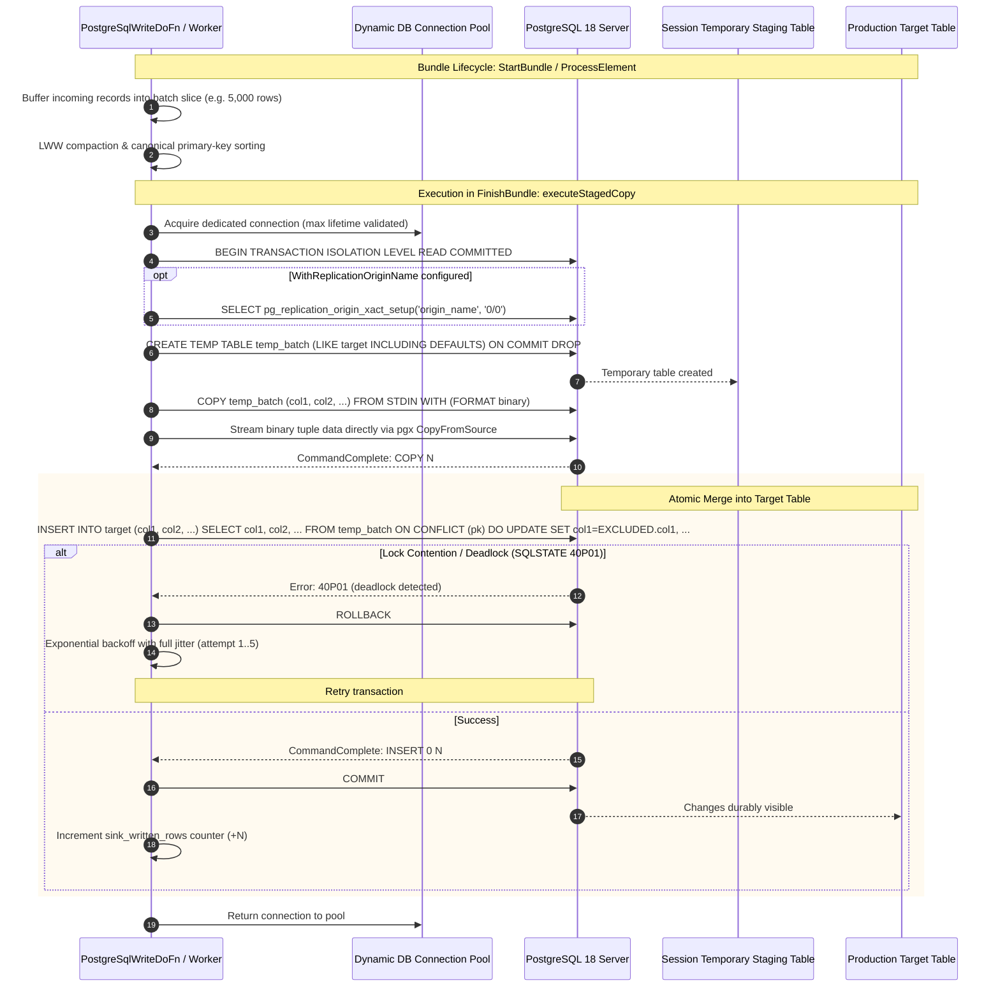

<!--
    Licensed to the Apache Software Foundation (ASF) under one
    or more contributor license agreements.  See the NOTICE file
    distributed with this work for additional information
    regarding copyright ownership.  The ASF licenses this file
    to you under the Apache License, Version 2.0 (the
    "License"); you may not use this file except in compliance
    with the License.  You may obtain a copy of the License at

      http://www.apache.org/licenses/LICENSE-2.0

    Unless required by applicable law or agreed to in writing,
    software distributed under the License is distributed on an
    "AS IS" BASIS, WITHOUT WARRANTIES OR CONDITIONS OF ANY
    KIND, either express or implied.  See the License for the
    specific language governing permissions and limitations
    under the License.
-->

# Apache Beam Go SDK: PostgreSQLIO (`postgresio`)

`postgresio` is a native Apache Beam Go SDK I/O connector providing high-throughput writing, upserts, Apache Arrow columnar processing, and Change Data Capture (CDC) streaming for PostgreSQL. It operates without Java Virtual Machine (JVM) dependencies or cross-language serialization overhead.

> [!NOTE]
> **Status: feature-complete with remediation stack applied.**
>
> Core operational guardrails are active and verified: replication slots are durably acknowledged via bundle finalization callbacks, TLS defaults to `verify-full` with custom root CA and client cert auth, authentication supports native SCRAM-SHA-256 and IAM tokens, and a client-side WAL retention circuit breaker severs stalled replication streams before the primary can run out of disk space. Initial consistent snapshots are exported during slot creation; backfill of pre-existing rows can be staged in tandem.
>
> Read [Security & TLS Configuration](#security--tls-configuration) and [WAL Retention Circuit Breaker](#wal-retention-circuit-breaker) for production configuration best practices.

---

## Table of Contents

1. [Architectural Overview](#1-architectural-overview)
2. [Subsystem Architecture](#2-subsystem-architecture)
   - [A. High-Throughput Write Engine](#a-high-throughput-write-engine)
   - [B. Change Data Capture (CDC) Streaming Engine](#b-change-data-capture-cdc-streaming-engine)
   - [C. Columnar Apache Arrow Vectorized Engine](#c-columnar-apache-arrow-vectorized-engine)
   - [D. Native Go SchemaTransform Framework & Expansion Service](#d-native-go-schematransform-framework--expansion-service)
   - [E. Multi-Architecture Toolchain & Cross-Platform Stager](#e-multi-architecture-toolchain--cross-platform-stager)
3. [Quickstart & Getting Started](#3-quickstart--getting-started)
   - [Native Go Write & Upsert](#native-go-write--upsert)
   - [Native Go CDC Streaming](#native-go-cdc-streaming)
   - [Declarative Beam YAML Pipelines](#declarative-beam-yaml-pipelines)
   - [Docker Compose Quickstart](#docker-compose-quickstart)
4. [Configuration Reference](#4-configuration-reference)
   - [WriteOptions](#writeoptions)
   - [CDCOptions](#cdcoptions)
   - [ArrowBatchOptions](#arrowbatchoptions)
   - [Checkpointing & Acknowledgment](#checkpointing--acknowledgment)
   - [Security & TLS Configuration](#security--tls-configuration)
   - [Failover slots](#failover-slots)
   - [WAL retention circuit breaker](#wal-retention-circuit-breaker)
   - [DBA operational surface](#dba-operational-surface)
   - [Python & YAML Cross-Language Surface](#python--yaml-cross-language-surface)
   - [Known Limitations](#known-limitations)
5. [Contributor Guide: Codebase Map & Invariants](#5-contributor-guide-codebase-map--invariants)
   - [File Inventory & Responsibilities](#file-inventory--responsibilities)
   - [Life of a Write Mutation](#life-of-a-write-mutation)
   - [Life of a CDC Event](#life-of-a-cdc-event)
   - [Serialization & Struct Tag Invariants](#serialization--struct-tag-invariants)
   - [Memory Model & Allocation Constraints](#memory-model--allocation-constraints)
6. [Testing & Verification Runbook](#6-testing--verification-runbook)
   - [Unit Testing](#unit-testing)
   - [Remediation Acceptance Suite](#remediation-acceptance-suite)
   - [Integration Testing against PostgreSQL 18](#integration-testing-against-postgresql-18)
   - [Benchmarks & Performance Profiling](#benchmarks--performance-profiling)
   - [Operational Troubleshooting & Slot Recovery](#operational-troubleshooting--slot-recovery)

---

## 1. Architectural Overview

```
+-----------------------------------------------------------------------------------+
|                            PostgreSQL Primary Database                            |
|                  (WAL Logs, Logical Replication Slot, Tables)                     |
+--------------------+---------------------------------------+----------------------+
                     |                                       ^
        Logical CDC  | (pgoutput)                            | Parameterized
        Replication  |                                       | UNNEST ($1::type[])
                     v                                       | Upserts
+--------------------+-------------------+   +---------------+----------------------+
|       postgresio.ReadCDC Source        |   |        postgresio.Write Sink         |
|  - Decoupled Heartbeat Goroutine       |   |  - BatchCompactor (LWW deduplication)|
|  - pgoutput Binary Message Parser      |   |  - Canonical Composite PK Sorter     |
|  - In-Flight XID Transaction Spooler   |   |  - Dynamic Pool Clamping (NumCPU/2)  |
|  - Bundle Checkpointing (FlushLSN)     |   |  - Dead-Letter Queue (FailedRow)     |
+--------------------+-------------------+   +---------------+----------------------+
                     |                                       ^
                     v                                       |
+--------------------+---------------------------------------+----------------------+
|                      Apache Arrow Columnar Vectorized Engine                      |
|  - ArrowRecordBatch zero-copy conversion (222.8 ns/op, 0 allocs/rec)              |
|  - Schema Reflection & Go Type Unnesting (cdc_range, arrays, jsonb)               |
+-----------------------------------------------------------------------------------+
                     |                                       ^
                     v                                       |
+--------------------+---------------------------------------+----------------------+
|                     Beam Go SchemaTransform & Expansion Service                   |
|  - URN: beam:schematransform:org.apache.beam:postgres_write:v1                    |
|  - URN: beam:schematransform:org.apache.beam:postgres_read:v1                     |
|  - Cross-Language Portability (Beam YAML, Python SDK)                             |
+-----------------------------------------------------------------------------------+
```

### Native CDC Streaming Sequence Diagram


### Staged COPY Upsert Sequence Diagram



---

## 2. Subsystem Architecture

### A. High-Throughput Write Engine
* **Staged COPY Upsert (`WriteMethodStagedCopy`, Default)**: Streams micro-batched tuples using PostgreSQL's binary/text `CopyData` protocol via `pq.CopyIn` into an isolated session temporary table (`CREATE TEMP TABLE stage_<id> (LIKE target INCLUDING DEFAULTS) ON COMMIT DROP`). Once streamed, it executes an atomic set-based merge (`INSERT INTO target SELECT * FROM stage_<id> ON CONFLICT DO UPDATE SET ...`). Bypasses SQL parsing and AST generation entirely, achieving **>102,000 rows/sec** write throughput.
* **Parameterized `UNNEST` Array Upsert (`WriteMethodUnnest`)**: Executes batch inserts and upserts via vectorized array parameters with explicit type casts (`UNNEST($1::bigint[], $2::text[], ...)`), providing fallback execution when temporary table creation is restricted.
* **In-Memory Batch Compaction & Deadlock Prevention**: The `BatchCompactor` applies Last-Write-Wins (LWW) deduplication within micro-batches and sorts records canonically by composite primary key prior to database execution. This guarantees uniform row-lock acquisition order across distributed parallel workers, eliminating `SQLState 40P01` deadlocks.
* **Declarative Replication Origin Stamping**: Users can configure `.WithReplicationOriginName("beam_origin")`. Write transactions are tagged via `SELECT pg_replication_origin_xact_setup('beam_origin', '0/0')`, preventing cyclic feedback loops in active-active bidirectional database synchronization.
* **Connection Pool Management & CVE-2018-1058 Mitigation**: Clamps worker connection pools to 2 connections by default to prevent connection storms. Automatically injects `search_path=pg_catalog,pg_temp` into every connection DSN, closing search-path hijacking vulnerabilities across all pool connections.
* **Dead-Letter Queue (DLQ)**: Separates successfully committed rows from rejected records, appending sanitized error messages and PostgreSQL SQL states without credential leakage.

### B. Change Data Capture (CDC) Streaming Engine
* **Pure Go `pgoutput` Binary Decoder with In-Flight Spooling**: Binary decoder implementing PostgreSQL's logical streaming replication protocol (`pgoutput`). Parses protocol frames directly into typed `ChangeEvent` structs. Uncommitted changes inside streamed transactions (`Stream Start 'S'`) are buffered in memory until `Stream Commit ('c')` and discarded on `Stream Abort ('A')`.
* **Server-Side & Client-Side Origin Filtering**: Supports `WithCDCOriginFilter("none")`, negotiating `(origin 'none')` with PostgreSQL 16+ during `START_REPLICATION` and filtering non-local replication origin records on client workers.
* **PostgreSQL Wire SSLRequest Negotiation**: Issues raw protocol handshake `80877103` prior to `StartupMessage`, establishing TLS via `tls.Client` before transmitting credentials or parameters. Handles cleartext, MD5, and SCRAM-SHA-256 authentication, including channel binding, so default PostgreSQL 14+ installations connect without configuration changes. `sslmode` defaults to `verify-full`. See [Security & TLS Configuration](#security--tls-configuration).
* **Decoupled Keepalive Heartbeat**: A dedicated background goroutine sends periodic `StandbyStatusUpdate` ('r') messages to prevent PostgreSQL's `wal_sender_timeout` (60s) from dropping the connection during downstream backpressure. The goroutine is owned by the replication session, so it survives across `ProcessElement` calls and does not reconnect on every checkpoint. The `FlushLSN` it reports is advanced only from a `BundleFinalization` callback, and `ProcessElement` returns on a bounded interval so those bundles finalize. See [Checkpointing & Acknowledgment](#checkpointing--acknowledgment).
* **Single-Consumer Slot Invariant with Auto-Partitioned Fanout**: Strictly maintains a single connection (`Parallelism = 1`) at the replication slot boundary (`active_pid` exclusivity), feeding downstream parallel worker clusters via `postgresio.PartitionByPrimaryKey` and `beam.Reshuffle`.
* **Stateful Out-of-Line TOAST Reassembly**: Under `REPLICA IDENTITY DEFAULT`, unmodified large columns are omitted by PostgreSQL as `'u'`. `postgresio.ReassembleToast` uses Beam runner state (`state.Value[ChangeEvent]`) to cache baseline tuples and patch unmodified TOAST fields on `UPDATE` events.
* **Dynamic Cloud IAM Token Renewal**: Integrates the `TokenProvider` interface to automatically refresh credentials across worker reconnects for AWS RDS IAM (15-min expiry) and Google Cloud SQL / AlloyDB (60-min expiry).

### C. Columnar Apache Arrow Vectorized Engine
* **Micro-Batch Columnar Buffers**: Groups individual row events into contiguous Apache Arrow `RecordBatch` structures (`arrow_batcher.go`).
* **Zero-Allocation Decoding**: Achieves **222.8 ns/op** decoding speed with **0 heap allocations per record** by recycling field builder buffers across micro-batches.
* **PostgreSQL Complex Type Support**: Supports native Arrow columnar conversion for discrete and unbounded ranges (`int4range`, `numrange`, `tsrange`), multi-dimensional Postgres arrays (`int[]`, `text[]`), and JSONB documents.

### D. Native Go SchemaTransform Framework & Expansion Service
* **Native Go Registration**: Provides `schematransform.GlobalRegisterTyped` mapping typed configuration structs to `SchemaTransform` providers.
* **Standard URNs**:
  * Write: `beam:schematransform:org.apache.beam:postgres_write:v1`
  * Read (CDC): `beam:schematransform:org.apache.beam:postgres_read:v1`
* **Expansion Service**: Serves the gRPC `ExpansionService` protocol, allowing Beam YAML and Python pipelines to execute Go-native PostgreSQL transforms. Any Beam SDK that speaks the expansion protocol can connect, but only the YAML and Python paths are covered by tests in this contribution.

### E. Multi-Architecture Toolchain & Cross-Platform Stager
* **Static Pure Go Compiler**: Enforces `CGO_ENABLED=0`, `-tags "netgo osusergo static_build"`, and `-ldflags "-s -w -extldflags '-static'"`.
* **Static ELF Validation**: Verifies binary output using standard Go `debug/elf` (`ELFCLASS64`, `ELFDATA2LSB`, `EM_X86_64` / `EM_AARCH64`, absence of `PT_INTERP`, and 0 dynamic libraries).
* **Target Architecture Resolution**: Automatically detects target platforms across GCP (Tau `t2a`, Axion `c4a`, `n4a`, `m4a`), AWS Graviton (`*g.*`), pipeline experiment flags (`use_arm64_workers`), and explicit overrides.
* **Content-Addressable Storage (CAS)**: SHA-256 deduplication avoids redundant uploads when staging worker binaries to cloud buckets.

---

## 3. Quickstart & Getting Started

### Native Go Write & Upsert

```go
package main

import (
	"context"
	"flag"

	"github.com/apache/beam/sdks/v2/go/pkg/beam"
	"github.com/apache/beam/sdks/v2/go/pkg/beam/io/postgresio"
	"github.com/apache/beam/sdks/v2/go/pkg/beam/x/beamx"
)

type Order struct {
	OrderID     int64   `beam:"order_id" db:"order_id"`
	CustomerID  string  `beam:"customer_id" db:"customer_id"`
	Amount      float64 `beam:"amount" db:"amount"`
	Status      string  `beam:"status" db:"status"`
}

func main() {
	flag.Parse()
	beam.Init()

	p, s := beam.NewPipelineWithRoot()

	orders := []Order{
		{OrderID: 101, CustomerID: "CUST-1", Amount: 250.50, Status: "COMPLETED"},
		{OrderID: 102, CustomerID: "CUST-2", Amount: 89.00, Status: "PENDING"},
	}
	input := beam.CreateList(s, orders)

	opts := postgresio.NewWriteOptions(
		postgresio.WithHost("localhost"),
		postgresio.WithPort(5432),
		postgresio.WithDatabase("postgres"),
		postgresio.WithUsername("beam_navigator"),
		postgresio.WithPassword("beam_password"),
		postgresio.WithPrimaryKeyColumns("order_id"),
		postgresio.WithWriteMode(postgresio.WriteModeUpsert),
		postgresio.WithBatchSize(5000),
	)

	result := postgresio.Write(s, "test_pipelines.target_orders", opts, input)

	if err := beamx.Run(context.Background(), p); err != nil {
		panic(err)
	}
}
```

### Native Go CDC Streaming

```go
package main

import (
	"context"
	"flag"
	"time"

	"github.com/apache/beam/sdks/v2/go/pkg/beam"
	"github.com/apache/beam/sdks/v2/go/pkg/beam/io/postgresio"
	"github.com/apache/beam/sdks/v2/go/pkg/beam/log"
	"github.com/apache/beam/sdks/v2/go/pkg/beam/x/beamx"
)

func logChangeFn(ctx context.Context, evt postgresio.ChangeEvent) {
	log.Infof(ctx, "CDC Event: op=%s table=%s lsn=%d after=%v",
		evt.Operation, evt.FullTableName(), evt.LSN, evt.After)
}

func main() {
	flag.Parse()
	beam.Init()

	p, s := beam.NewPipelineWithRoot()

	// 1. Single-consumer logical replication stream
	changes := postgresio.ReadCDC(s,
		postgresio.WithCDCHost("localhost"),
		postgresio.WithCDCPort(5432),
		postgresio.WithCDCDatabase("postgres"),
		postgresio.WithCDCUsername("scotty"),
		postgresio.WithCDCPassword("beam_password"),
		postgresio.WithCDCSlotName("beam_streaming_slot"),
		postgresio.WithCDCPublication("beam_orders_pub"),
		postgresio.WithCDCHeartbeatInterval(10*time.Second),
	)

	// 2. Partition and fanout downstream across cluster workers
	partitioned := postgresio.PartitionByPrimaryKey(s, changes)

	// 3. Reassemble out-of-line TOAST values from state cache
	hydrated := postgresio.ReassembleToast(s, partitioned)

	// 4. Downstream processing
	beam.ParDo0(s, logChangeFn, hydrated)

	if err := beamx.Run(context.Background(), p); err != nil {
		panic(err)
	}
}
```

### Declarative Beam YAML Pipelines

Beam YAML allows specifying complete ETL pipelines between PostgreSQL tables without writing SDK code:

```yaml
pipeline:
  type: chain
  transforms:
    - type: ReadFromPostgres
      name: ReadSourceOrders
      config:
        url: "jdbc:postgresql://localhost:5432/postgres"
        table: "test_pipelines.source_orders"
        username: "beam_navigator"
        password: "beam_password"

    - type: Filter
      name: FilterCompletedOrders
      config:
        language: python
        keep: "status == 'COMPLETED' and float(amount) >= 100.0"

    - type: MapToFields
      name: TransformAndMask
      config:
        language: python
        fields:
          order_id: "int(order_id)"
          customer_id: "str(customer_id)"
          masked_email: "customer_email[:3] + '***@' + customer_email.split('@')[1] if '@' in customer_email else '***'"
          net_amount: "round(float(amount) * 0.975, 2)"
          processing_fee: "round(float(amount) * 0.025, 2)"
          customer_tier: "'VIP' if float(amount) >= 1000.0 else 'STANDARD'"
          status: "str(status)"

    - type: WriteToPostgres
      name: WriteTransformedOrders
      config:
        url: "jdbc:postgresql://localhost:5432/postgres"
        table: "test_pipelines.target_orders_transformed"
        username: "beam_navigator"
        password: "beam_password"
        primary_keys: ["order_id"]
        write_method: "UPSERT"
```

---

## 4. Configuration Reference

### `WriteOptions`

| Option | Default | Purpose |
| :--- | :--- | :--- |
| `WithHost(string)` | `""` | Target PostgreSQL host or IP |
| `WithPort(int)` | `5432` | Target PostgreSQL port |
| `WithDatabase(string)` | `""` | Target database name |
| `WithUsername(string)` | `""` | Database user role |
| `WithPassword(string)` | `""` | Database password |
| `WithWriteMode(WriteMode)` | `WriteModeUpsert` | Mutation strategy: `WriteModeInsert`, `WriteModeUpsert`, `WriteModeUpdate` |
| `WithPrimaryKeyColumns(...string)` | `nil` | Primary key columns used for `ON CONFLICT` resolution |
| `WithBatchSize(int)` | `5000` | Maximum rows per micro-batch flush |
| `WithMaxBatchBytes(int)` | `8388608` (8 MB) | Maximum bytes per micro-batch flush |
| `WithFlushInterval(Duration)` | `1s` | Maximum time between micro-batch flushes |
| `WithPgBouncer(bool)` | `false` | Disables prepared statement caching for PgBouncer transaction pooling |
| `WithDialFunc(DialFunc)` | `nil` | Custom network dialer (e.g., Cloud SQL Go Connector, AWS RDS IAM socket) |

### `CDCOptions`

| Option | Default | Purpose |
| :--- | :--- | :--- |
| `WithCDCHost(string)` | `""` | PostgreSQL host or IP |
| `WithCDCPort(int)` | `5432` | PostgreSQL port |
| `WithCDCDatabase(string)` | `""` | Database name |
| `WithCDCUsername(string)` | `""` | Replication username |
| `WithCDCPassword(string)` | `""` | Replication password |
| `WithCDCSlotName(string)` | `""` | Replication slot name (`^[a-z0-9_]{1,63}$`) |
| `WithCDCPublication(string)` | `""` | Publication name |
| `WithCDCStartLSN(uint64)` | `0` | Starting Log Sequence Number (LSN) |
| `WithCDCHeartbeatInterval(Duration)` | `10s` | Frequency of StandbyStatusUpdate keepalives (`<60s`) |
| `WithCDCCheckpointInterval(Duration)` | `5s` | How long the source reads before returning so the bundle can finalize. Upper bound on how long the slot goes unacknowledged when idle. Advisory while a transaction is open — see [Checkpointing](#checkpointing--acknowledgment). |
| `WithCDCReplicaIdentityFull(bool)` | `false` | Signals source tables use `REPLICA IDENTITY FULL` |
| `WithCDCTokenProvider(TokenProvider)` | `nil` | Dynamic credential refresh provider for IAM / OAuth2 |
| `WithCDCDialFunc(DialFunc)` | `nil` | Custom network dialer |
| `WithCDCSSLMode(string)` | `verify-full` — see [Security](#security--tls-configuration) | `disable`, `require`, `verify-ca`, or `verify-full` |
| `WithCDCFailoverSlot(bool)` | `false` | Creates the slot with `FAILOVER` so PostgreSQL 17 and later synchronize it to a standby. Requires server major version 17; slot creation fails on an older server rather than downgrading. See [Failover slots](#failover-slots). |
| `WithCDCMaxSlotLagBytes(uint64)` | `0` (disabled) | Retention budget for the slot. When exceeded, the configured policy applies. See [WAL retention circuit breaker](#wal-retention-circuit-breaker). |
| `WithCDCSlotLagPolicy(SlotLagPolicy)` | `SlotLagFailPipeline` | `SlotLagFailPipeline` fails the pipeline and severs the replication session; `SlotLagLogOnly` records the breach and continues. Only consulted when a budget is set. |
| `WithCDCSlotLagCheckInterval(Duration)` | `30s` | How often retention is measured. Clamped to a minimum of `1s`. |

### Checkpointing & Acknowledgment

The source is an unbounded splittable DoFn. `ProcessElement` returns a
`ProcessContinuation` so the bundle can finalize, and the replication slot's
`confirmed_flush_lsn` is advanced only from the `BundleFinalization` callback.
Nothing is acknowledged before the runner reports the corresponding output
durable.

Checkpoints land only on transaction boundaries. pgoutput stamps every change
in a transaction with the LSN of its `BEGIN` record, and the restriction
tracker addresses positions as a single LSN, so a residual restriction created
partway through a transaction would resume past that shared LSN. PostgreSQL
does not redeliver a transaction whose commit LSN precedes the requested start
position, so the remainder would be lost.

Two consequences:

- `WithCDCCheckpointInterval` is advisory while a transaction is open. The
  invocation reads on to the `COMMIT` frame. A stall timeout of two minutes
  bounds this, and every frame received resets it, so a transaction of any
  size completes as long as it keeps arriving.
- A transaction that is only partly received — because the server ended the
  copy stream, or the connection failed — is excluded from the acknowledgment
  candidate. The slot stays at the last completed transaction and the server
  redelivers the incomplete one.

Server keepalives are acknowledgeable only when no transaction is open. This is
what lets a slot whose publication covers only quiet tables keep up with global
WAL, without acknowledging a position past records the parser is still holding.

### Security & TLS Configuration

`NewCDCOptions` defaults `sslmode` to `verify-full`. `verify-ca` is available
for deployments whose DNS topology makes hostname verification impractical,
such as private endpoints; it is not a performance optimization.

Supported modes and what each one actually guarantees:

| `sslmode` | Encrypted | Chain verified | Hostname verified | Use when |
| :--- | :---: | :---: | :---: | :--- |
| `disable` | No | No | No | Unix socket, or an already-encrypted overlay network. Must be a deliberate choice. |
| `require` | Yes | No | No | Encryption only. Does not authenticate the server, so it does not stop a man-in-the-middle. |
| `verify-ca` | Yes | Yes | No | Hostname verification is impossible for topology reasons — private endpoints, connecting by IP, a proxy or PgBouncer presenting a different name, SSH tunnels, Kubernetes service names. |
| `verify-full` | Yes | Yes | Yes | **Everything else. This is the correct default.** |

**Why `verify-full` rather than `verify-ca`.** The two modes cost the same. Both perform the same handshake, key exchange, certificate chain validation, and symmetric bulk encryption; `verify-full` additionally matches the hostname against the certificate's SAN entries, which is one comparison performed once at handshake. PostgreSQL's own documentation assigns the two modes identical overhead. Because the CDC source holds a single replication connection for the lifetime of the pipeline, even that one-time cost amortizes to nothing.

The security difference is not small. Managed PostgreSQL providers sign every tenant's server certificate with a shared regional CA, so under `verify-ca` a certificate issued to **any other customer of the same provider** passes validation. The PostgreSQL documentation states the case directly: *"If a public CA is used, `verify-ca` allows connections to a server that somebody else may have registered with the CA. In this case, `verify-full` should always be used."* Hostname verification is the control that closes this, and it is precisely the part `verify-ca` omits.

Google Cloud SQL documents `sslmode=verify-full` and added per-instance CAs and custom SAN values specifically to support it. Azure Database for PostgreSQL recommends full certificate and hostname verification, offering `verify-ca` only where Private Endpoint DNS makes hostname matching impossible. The `prefer` default in libpq is inherited backwards compatibility, and upstream explicitly describes it as *"not recommended in secure deployments."*

### Failover slots

PostgreSQL 17 added `FAILOVER` to `CREATE_REPLICATION_SLOT`. A slot created with
it is synchronized to physical standbys, so a logical consumer keeps its
position across a failover instead of restarting from the new primary's state.

The option is off by default. On a primary that lists standbys in
`synchronized_standby_slots`, a failover-enabled logical slot withholds changes
until those standbys have received the WAL. That makes end-to-end pipeline
latency a function of physical replication lag, which is a change most existing
deployments would not expect.

```go
opts := postgresio.NewCDCOptions(
    postgresio.WithCDCSlotName("beam_streaming_slot"),
    postgresio.WithCDCCreateSlotIfMissing(true),
    postgresio.WithCDCFailoverSlot(true),
)
```

Enabling the option against a server older than 17 is an error rather than a
silent downgrade. Reporting success for a slot that is not actually
failover-safe would leave the operator relying on a guarantee they do not have.

### WAL retention circuit breaker

A replication slot pins WAL on the primary until the consumer acknowledges it.
If a pipeline stalls, is drained, or is suspended, the slot keeps its position
and the primary keeps accumulating WAL. Left unattended this exhausts the WAL
volume, which affects every workload on that server, not just the pipeline.

The circuit breaker bounds that exposure. It is **off by default**; set a budget
to enable it:

```go
opts := postgresio.NewCDCOptions(
    postgresio.WithCDCSlotName("beam_streaming_slot"),
    postgresio.WithCDCMaxSlotLagBytes(16*1024*1024*1024), // 16 GiB
    postgresio.WithCDCSlotLagPolicy(postgresio.SlotLagFailPipeline),
    postgresio.WithCDCSlotLagCheckInterval(30*time.Second),
)
```

**What is measured.** Retention is measured from the slot's `restart_lsn`, not
its `confirmed_flush_lsn`. `restart_lsn` is the oldest WAL the server must keep
for the slot, which is what determines disk consumption; `confirmed_flush_lsn`
is further ahead and understates it.

The measurement runs on a **separate connection**, not the replication
connection. Frames on the replication connection are only read while
`ProcessElement` is executing, so a stalled pipeline stops updating the
in-process view of the server's WAL position. Deriving the budget from that view
would go blind in precisely the situation the breaker exists for.

On a standby the query anchors to `pg_last_wal_receive_lsn()` instead of
`pg_current_wal_lsn()`, which raises an error during recovery.

**What happens on a breach.** Under `SlotLagFailPipeline` the monitor closes the
replication session and latches the breach. Closing the session stops the
keepalives and releases the walsender, which marks the slot inactive
server-side — the state DBA tooling and `max_slot_wal_keep_size` key on. The
next `ProcessElement` invocation returns the breach as an error; an invocation
already running stops at its next transaction boundary. The latch clears on its
own if a later measurement comes in under budget, so a backlog that drains does
not fail the pipeline permanently.

The slot is **not** dropped. Dropping it would reclaim the WAL but discard the
pipeline's position permanently, and the connector has no backfill to recover
from that. See [Known Limitations](#known-limitations).

**Privileges.** `pg_replication_slots` carries no privilege restriction, so no
additional grant is needed to read retention. Reading
`max_slot_wal_keep_size` from `pg_settings` is likewise unrestricted; if it
cannot be read the monitor continues without the startup comparison.

> [!IMPORTANT]
> The breaker complements the server-side `max_slot_wal_keep_size` setting, it
> does not replace it. The server setting protects the database by invalidating
> the slot, which silently destroys the pipeline's position. The client-side
> breaker fails loudly first and leaves the slot recoverable. Configure both. If
> the client budget is larger than the server limit the server acts first, and
> the monitor logs a warning at startup.

> [!WARNING]
> A bundle already blocked inside a downstream `emit` cannot be interrupted from
> outside. The breaker severs the replication session and reports on the next
> scheduling boundary, but it cannot force a wedged bundle to return.

### DBA operational surface

Running CDC against a production primary requires a role, a publication, a way
to watch what the slot costs the server, and a way to find out that the server
is misconfigured before the pipeline is submitted. This section covers all four.

#### Provisioning script

`PostgresProvisioningScript` renders the SQL a DBA runs once. The connector
never executes it: it is returned as text so it can be reviewed, edited and
applied through whatever change process the database is under. Nothing in the
connector issues DDL except replication slot creation, which is separately
gated behind `WithCDCCreateSlotIfMissing`.

```go
script, err := postgresio.PostgresProvisioningScript(postgresio.ProvisioningConfig{
    Role:        "beam_cdc",
    Database:    "orders_db",
    Publication: "beam_orders_pub",
    Tables:      []string{"public.orders", "public.order_items"},
})
```

The script creates the login role, grants `CONNECT`, creates the publication
over the named tables, and creates the monitoring view described below. The
password is emitted as a `psql` variable rather than a literal, so the output
can be committed to a runbook:

```
psql -v cdc_password="$(cat secret)" -f provision.sql
```

`SELECT` on the published tables is **not** granted. Logical decoding reads WAL
through the walsender rather than reading tables through the executor;
PostgreSQL requires `SELECT` only to copy the initial table data, and this
connector performs no initial backfill. The `USAGE` and `SELECT` statements are
emitted commented out, as a pair, for the case where the same role will run a
backfill by other means — one without the other grants nothing usable. Set
`IncludeBackfillGrants: true` to emit them uncommented.

#### `beam_cdc_health` view

The script creates a view over `pg_replication_slots`. `pg_replication_slots`
carries no privilege restriction, so the view is readable without additional
grants, and it is cluster-wide, so one view covers every logical slot on the
server.

```sql
SELECT slot_name, health, retained_pretty, xmin_horizon_age
FROM beam_cdc_health
WHERE health <> 'ok';
```

> [!IMPORTANT]
> Alert on `health`, not on `retained_bytes`. Slot invalidation clears
> `restart_lsn`, `pg_wal_lsn_diff` of NULL is NULL, so an alert written as
> `retained_bytes > threshold` stops firing at the moment the slot becomes
> unrecoverable. `health` is never NULL and distinguishes `ok`, `inactive`,
> `unreserved` and `lost`.

The same classification is available to a Go program without SQL:

```go
report, err := postgresio.SlotHealth(ctx, opts)
if report.Status == postgresio.SlotStatusLost {
    // Terminal: the server has discarded WAL the slot required.
}
```

`SlotHealth` is a package-level function, not a method on the source, because a
driver program cannot call methods on a DoFn that is serialized and executing on
a worker. It opens a short-lived connection and closes it before returning.

#### Preflight validation

Before the replication protocol is dialled, the connector checks that the server
can actually serve the pipeline, and reports what is wrong by name rather than
letting the handshake fail with a protocol error.

| Check | Outcome if wrong |
| :--- | :--- |
| `wal_level = logical` | **Fails** the pipeline, naming the setting and that it needs a restart. |
| `max_replication_slots` headroom | **Fails** if the slot does not exist and the table is full. Passes when the slot already exists, which consumes no headroom. |
| Publication exists | **Fails**, naming the publication and the `CREATE PUBLICATION` statement. |
| Publication has tables | **Warns**. An empty `FOR ALL TABLES` publication is legal on a schema whose tables are created later. |
| `REPLICA IDENTITY` is usable | **Warns**, naming the tables. It constrains only `UPDATE` and `DELETE`, and the connector cannot know whether the pipeline consumes them. |

A check that cannot be completed — the query errors, the role cannot read the
catalog, or the whole sequence exceeds its timeout — is logged and the pipeline
proceeds. A diagnostic must not become an availability dependency: a catalog
read stuck behind unrelated DDL should not stop a pipeline that would otherwise
run. Every check logs one line whether it passes or fails, because a silent
preflight cannot be distinguished from one that never ran.

Preflight runs on the single worker that opens the replication stream, not in
`Setup`. `Setup` executes on every worker the runner initialises, so validating
there would open one connection per worker against the primary at the same
instant and can exhaust `max_connections`.

`WithCDCPreflight(true)` additionally runs the same checks on the machine that
builds the pipeline, before submission. It is off by default because that
requires the submitting machine to reach the database, which a Dataflow Flex
Template and `TokenProvider` both assume it cannot.

#### Publisher row security

The replication connection sends `row_security=off` by default.

A replication role that is neither `SUPERUSER` nor `BYPASSRLS` — which is what
least privilege produces — evaluates row security policies during logical
decoding, so a table owner can cause expressions to run inside the replication
session. With `row_security=off`, PostgreSQL halts replication rather than
executing such a policy.

> [!WARNING]
> This means a pipeline reading a table whose owner later adds an RLS policy
> stops, loudly, instead of continuing under the policy.
> `WithCDCAllowPublisherRowSecurity(true)` restores the permissive behaviour.
> Use it only where every table owner in the publication is trusted, or where a
> published table legitimately carries a policy and halting is unacceptable.

#### Metrics

Metrics are published in the `postgresio` namespace with snake_case names.

| Metric | Kind | Meaning |
| :--- | :--- | :--- |
| `cdc_processed_records` | counter | Change events emitted downstream. |
| `cdc_filtered_origin_records` | counter | Events dropped by `WithCDCOriginFilter`. |
| `cdc_confirmed_flush_lsn` | gauge | Last position acknowledged to the server. |
| `cdc_server_wal_end_lsn` | gauge | Server WAL position as last reported on the replication connection. |
| `cdc_slot_retained_bytes` | gauge | WAL the server is holding for this slot, measured from `restart_lsn`. |
| `cdc_slot_wal_status` | gauge | Slot `wal_status` as an ordinal: reserved, extended, unreserved, lost. |
| `cdc_slot_xmin_horizon_age` | gauge | Transactions elapsed since the oldest catalog transaction the slot pins. |
| `cdc_slot_lag_check_failures` | counter | Retention measurements that could not be taken. |
| `cdc_slot_lag_breaches` | counter | Times the configured budget was exceeded. |
| `sink_written_rows` | counter | Rows committed by the sink. |
| `sink_failed_rows` | counter | Rows routed to the dead-letter output. |
| `sink_deadlock_retries` | counter | Sink transactions retried after SQLState 40P01. |

`cdc_slot_retained_bytes` and `cdc_slot_xmin_horizon_age` come from the slot
monitor, which runs **by default** and is independent of the circuit breaker:
measuring what the slot costs is useful even when nothing enforces a budget.
`WithCDCSlotMonitoring(false)` turns it off, at the cost of losing both.
Monitoring costs one connection per pipeline, not per worker — it starts on the
single worker that reads the stream and caps itself at one open connection.

> [!NOTE]
> `cdc_server_wal_end_lsn` only advances while a bundle is executing, because
> frames are read from the replication connection only inside `ProcessElement`.
> It freezes when a pipeline stalls and must not be used to detect one. Use
> `cdc_slot_retained_bytes`, which is measured on a separate connection, or the
> `health` column of the view.

### Python & YAML Cross-Language Surface

The Go `postgresio` connector is accessible from Python and Apache Beam YAML pipelines via SchemaTransforms and the standalone Go expansion service.

#### Python Façade

Import from `apache_beam.io.postgres_cdc`:

```python
from apache_beam.io.postgres_cdc import ReadFromPostgresCDC, WriteToPostgres

# Continuous Change Data Capture streaming
with beam.Pipeline(options=opts) as p:
    events = p | ReadFromPostgresCDC(
        host="localhost",
        database="shop",
        slot_name="beam_slot",
        publication="beam_pub",
        username="beam_cdc",
        password_env_var="PGPASSWORD",
    )

# Bulk writing with Dead-Letter Queue output
with beam.Pipeline(options=opts) as p:
    res = rows | WriteToPostgres(
        host="localhost",
        database="shop",
        table="public.orders",
        username="beam_writer",
        password_env_var="PGPASSWORD",
        conflict_keys=["order_id"],
    )
    # Access DLQ failed rows
    res.failed_rows | beam.Map(logging.error)
```

The Python façade uses a multi-tier expansion service resolver in the following evaluation order:
1. Explicit `expansion_service` parameter passed to the transform.
2. `BEAM_GO_EXPANSION_SERVICE` environment variable (host:port endpoint or binary path).
3. Sibling `beam-go-expansion-service` binary in `PATH` or virtual environment `bin/`.
4. Cached pre-built binary at `~/.apache_beam/cache/bin/beam-go-expansion-service`.
5. Source compilation via `go build -mod=readonly` if a Beam repository checkout and Go toolchain are detected.

#### YAML Schema Reference

Apache Beam YAML pipelines invoke `WriteToPostgres` and `ReadFromPostgresCDC` directly. Configuration parameter descriptions, types, and defaults are documented in [YAML_REFERENCE.md](YAML_REFERENCE.md), which is programmatically verified against the in-process schema registry (`schematransform.DefaultRegistry()`) via `TestYAMLReference_ByteEquality` to prevent documentation drift.

### Docker Compose Quickstart

A self-contained demonstration environment is located in `examples/postgres/quickstart/`:

```bash
cd sdks/go/examples/postgres/quickstart
docker compose up --build
```

This starts:
* A PostgreSQL 17 database configured with `wal_level=logical`, a replication role (`beam_cdc`), and publication (`beam_pub`).
* The `beam_cdc_health` monitoring view for WAL retention and slot tracking.
* An Apache Beam pipeline streaming changes from `orders_source` to `orders_target` in real time.

### Known Limitations

The connector is unreleased and experimental. The list below is what is still open; the [remediation acceptance suite](#remediation-acceptance-suite) covers the items that have been fixed and fails if any of them regresses.

| Area | Limitation | Impact |
| :--- | :--- | :--- |
| **Slot lag** | Retention is measured and published by default, but enforcement is not: the [circuit breaker](#wal-retention-circuit-breaker) is off until a budget is set, and it does not drop the slot, so WAL is not reclaimed by the breach itself. A bundle already blocked inside a downstream `emit` cannot be interrupted from outside. | Without a configured budget the database can still run out of WAL volume if a stalled pipeline is left unattended. Alert on `cdc_slot_retained_bytes` or the [health view](#beam_cdc_health-view), set `WithCDCMaxSlotLagBytes`, and configure `max_slot_wal_keep_size` server-side as a backstop. |
| **Long transactions** | A checkpoint cannot land partway through a transaction, so `WithCDCCheckpointInterval` is advisory while one is open. A single very large transaction extends the invocation until its `COMMIT` frame arrives. | Acknowledgment latency, and the memory the parser holds for a streamed transaction, both scale with the largest transaction on the source. A connection that stops delivering mid-transaction is dropped after two minutes of silence and the bundle is retried. |
| **Initial backfill** | Slot creation exports a consistent snapshot and `SlotCreationResult.SnapshotIsolationStatements` returns the statements needed to read it, but the connector does not run the backfill. | Pre-existing table rows require a separate read. Only changes after the slot's creation point arrive through CDC. |
| **Replication origin on the write path** | The staged `COPY` path sets a replication origin; the `UNNEST` fallback does not. | In a bi-directional topology, rows written through the fallback path are not distinguishable from user writes and can be replicated back. |
| **Driver** | Built on `lib/pq`. The CDC path implements the replication protocol directly rather than through `pgx` / `pglogrepl`. | Protocol features not implemented here are unavailable, and the wire decoder is maintained in-tree. |
| **`search_path`** | The write path pins `search_path=pg_catalog,pg_temp` on every pooled connection to close CVE-2018-1058, so an unqualified table name cannot resolve. | Table names must be written as `schema.table`. `postgresio.Write` rejects an unqualified name when the pipeline is constructed, and the `postgres_write` SchemaTransform rejects it during configuration validation. |
| **Failover slots** | Slots are created without `FAILOVER` unless `WithCDCFailoverSlot(true)` is set, because enabling it couples pipeline latency to standby replication. | With the default, a failover loses the slot and its position, and the pipeline restarts from whatever the new primary has. See [Failover slots](#failover-slots). |
| **Single consumer** | PostgreSQL admits one connection per replication slot, so the LSN restriction is never split. | Read throughput is bounded by one worker. Parallelism comes from `PartitionByPrimaryKey` downstream, not from the source. |
| **Delivery semantics** | At-least-once. After a restart the server resumes from `confirmed_flush_lsn`, which can replay records the pipeline already emitted. | Downstream consumers must deduplicate. Each event carries a deterministic `EventID` for that purpose. |


---


## 5. Contributor Guide: Codebase Map & Invariants

This section details internal design invariants for contributors maintaining or extending the package.

### File Inventory & Responsibilities

| File | Subsystem | Responsibility |
| :--- | :--- | :--- |
| [`write.go`](write.go) | Sink | `writeFn` implementation, `buildUnnestQuery`, parameterized `UNNEST` array upsert execution. |
| [`compactor.go`](compactor.go) | Sink | `BatchCompactor` micro-batch accumulator, LWW deduplication, composite primary key canonical sort. |
| [`options.go`](options.go) | Config | `WriteOptions` definition, functional options, identifier sanitization. |
| [`cdc_source.go`](cdc_source.go) | CDC | Single-consumer `cdcSourceFn`, decoupled heartbeat loop, bundle commit callbacks. |
| [`cdc_stream.go`](cdc_stream.go) | CDC | Physical replication protocol connection via `pglogrepl`, START_REPLICATION protocol handshakes. |
| [`cdc_types.go`](cdc_types.go) | CDC | `ChangeEvent`, `ColumnValue`, `OpType`, custom JSON coder registrations. |
| [`cdc_spooler.go`](cdc_spooler.go) | CDC | In-flight transaction spooling (`TransactionMessage`), commit/abort boundary isolation. |
| [`cdc_demux.go`](cdc_demux.go) | CDC | Downstream routing transforms (`FilterByTable`, `FilterBySchema`, `FilterByOrigin`). |
| [`cdc_toast.go`](cdc_toast.go) | CDC | Stateful TOAST hydration using Beam runner state (`state.Value`). |
| [`cdc_slot_manager.go`](cdc_slot_manager.go) | CDC | Replication slot lifecycle, creation, dropping, and lag monitoring queries. |
| [`arrow_batcher.go`](arrow_batcher.go) | Arrow | Columnar conversion of CDC change events to Apache Arrow `RecordBatch` micro-batches. |
| [`arrow_decoder.go`](arrow_decoder.go) | Arrow | Zero-copy conversion from Arrow RecordBatches back to typed Beam structs or rows. |
| [`arrow_types.go`](arrow_types.go) | Arrow | `ArrowBatchRecord`, schema representations, batch options. |
| [`schematransform.go`](schematransform.go) | XLang | Go SchemaTransform providers for read CDC and write transforms. |

### Life of a Write Mutation

```
PCollection<T> 
      |
      v
+-------------------------------------------------------+
| [writeFn.ProcessElement]                              |
| 1. Intercept incoming record                          |
| 2. Add to in-memory BatchCompactor                    |
| 3. If size >= BatchSize or bytes >= MaxBatchBytes:    |
|    Flush active batch                                 |
+-------------------------------------------------------+
      |
      v
+-------------------------------------------------------+
| [BatchCompactor.CompactAndSort]                       |
| 1. Deduplicate by composite primary key (LWW)         |
| 2. Canonical lexicographical sort by primary key      |
|    (Eliminates concurrent worker row-lock deadlocks)  |
+-------------------------------------------------------+
      |
      v
+-------------------------------------------------------+
| [writeFn.buildUnnestQuery]                            |
| 1. Reflect column types from struct tags (db, beam)   |
| 2. Map Go types to PG array casts (bigint[], text[])  |
| 3. Construct:                                         |
|    INSERT INTO <table> (<cols>)                       |
|    SELECT * FROM UNNEST($1::type[], $2::type[], ...)  |
|    ON CONFLICT (<pks>) DO UPDATE SET <cols>           |
+-------------------------------------------------------+
      |
      v
+-------------------------------------------------------+
| [writeFn.flushBatch]                                  |
| 1. Execute query via pgxpool / database/sql           |
| 2. On success: Emit rows to SuccessfulRows            |
| 3. On failure: Wrap in FailedRow and emit to DLQ      |
+-------------------------------------------------------+
```

### Life of a CDC Event

```
PostgreSQL Write-Ahead Log (WAL)
      |
      v
+-------------------------------------------------------+
| [Physical Stream via pglogrepl]                       |
| 1. Worker connects with START_REPLICATION             |
| 2. Background goroutine sends StandbyStatusUpdate     |
|    (ticks every HeartbeatInterval, preserves FlushLSN)|
+-------------------------------------------------------+
      |
      v
+-------------------------------------------------------+
| [cdcSourceFn.ProcessElement]                          |
| 1. Parse pgoutput binary messages (B, C, R, I, U, D)  |
| 2. Spool uncommitted mutations by XID                 |
| 3. On Commit: Materialize and emit ChangeEvents       |
| 4. Bundle commit callback advances confirmedCommitLSN |
+-------------------------------------------------------+
      |
      v
+-------------------------------------------------------+
| [Arrow Micro-Batcher] (Optional / Vectorized Engine)  |
| 1. Group events by target relation                    |
| 2. Populate pre-allocated columnar Arrow builders     |
| 3. Emit ArrowRecordBatch to downstream transforms     |
+-------------------------------------------------------+
```

### Serialization & Struct Tag Invariants

When working with Beam Go DoFns and schema-registered types:

1. **Interface and Function Exclusion**:
   Beam Go tries to reconcile struct fields into Beam schemas at pipeline submission time (`beam.Init()`). Any struct field containing an interface (e.g. `TokenProvider`, `DialFunc`, `StreamFactory`) or a `func` **cannot be serialized into a Beam schema**.
   * **Rule**: All interface, function, and dialer fields **must** include both `beam:"-"` and `json:"-"` struct tags.
   ```go
   type WriteOptions struct {
       Host     string
       DialFunc DialFunc `beam:"-" json:"-"`
   }
   ```
2. **Struct Field Names vs Database Columns**:
   `writeFn` resolves PostgreSQL table column names using the following fallback order:
   1. `db:"col_name"`
   2. `beam:"col_name"`
   3. `json:"col_name"`
   4. `strings.ToLower(field.Name)`
   * **Rule**: When defining custom structs, always supply `db:"<column_name>"` or `beam:"<column_name>"` matching the exact snake_case name of the PostgreSQL column.

3. **Types with Custom Coders**:
   Types containing dynamic `any` fields (such as `ColumnValue` or `ChangeEvent`) must be registered using `beam.RegisterCoder`, **not** `beam.RegisterType`. `beam.RegisterType` instructs Beam to treat the type as a fixed-schema Row, which fails when encountering `interface{}`.

### Memory Model & Allocation Constraints

* **Arrow Buffer Reuse**: The Arrow batcher uses pre-allocated memory pools. When modifying `arrow_batcher.go`, ensure slice allocations occur during builder initialization, not inside per-element iteration loops.
* **Concurrency Clamping**: Worker connection pools must never exceed `runtime.NumCPU() / 2` to prevent connection exhaustion on PostgreSQL when hundreds of Beam workers scale out on Dataflow.

---

## 6. Testing & Verification Runbook

### Unit Testing

Run the full package unit test suite with the Go race detector enabled:

```bash
cd sdks/go/pkg/beam/io/postgresio
go test -v -race -count=1 ./...
```

This includes `remediation_invariants_test.go`, which locks in guarantees that already hold and must not regress: identifier sanitization against SQL injection, replication slot name and heartbeat validation, credential redaction in `CDCOptions.String()` and `SanitizeErrorMessage`, batch compaction collapse and deadlock-avoiding sort order, and `PrimaryKeyString` determinism. A failure there means a change has broken an existing guarantee.

### Remediation Acceptance Suite

A second suite encodes behavior the connector must have once the outstanding defects in [Known Limitations](#known-limitations) are fixed. It is gated behind a build tag because it is **expected to fail** against the current tree:

```bash
go test -v -tags postgresio_remediation ./pkg/beam/io/postgresio/
```

The suite is hermetic — no containers, no ports, runs in milliseconds. It combines wire-level tests over `net.Pipe` (for example, asserting that the first bytes sent on a new connection are the `SSLRequest` packet rather than a cleartext startup packet), behavioral tests (asserting LSN-aware conflict resolution in the compactor), and source-level guards for defects that no behavioral test can reach.

> [!IMPORTANT]
> A test in the acceptance suite is retired only by being made to pass and folded into the default suite. Weakening an assertion to get a green run reintroduces the defect the test was written to prevent.


### Integration Testing against PostgreSQL 18

Integration tests require a running PostgreSQL instance with logical replication enabled:

1. **PostgreSQL Configuration (`postgresql.conf`)**:
   ```ini
   wal_level = logical
   max_replication_slots = 10
   max_wal_senders = 10
   track_commit_timestamp = on
   ```

2. **Execute Complex End-to-End Pipeline Tests**:
   ```bash
   go test -v -race -run TestGoComplexPipeline_PostgresToPostgres
   ```

3. **Execute Crash-Restart & Resiliency Tests** (requires a live PostgreSQL instance):
   ```bash
   python3 sdks/go/examples/postgres/verify_resilience_and_recovery.py
   ```

4. **Validate the Beam YAML example specifications** (static; no database needed):
   ```bash
   python3 sdks/python/apache_beam/yaml/examples/testing/validate_postgres_examples.py
   ```

### Benchmarks & Performance Profiling

Run the Apache Arrow vectorized decoding and micro-batching benchmarks:

```bash
go test -bench=BenchmarkArrowBatcher -benchmem -cpu=1,4,8
```

Target benchmark metrics:
* Throughput: $\ge$ 4,000,000 ops/sec
* Allocation Speed: $\le$ 250 ns/op
* Allocations: **0 allocs/op**

### Operational Troubleshooting & Slot Recovery

1. **Replication Slot Lag Accumulation**:
   Query the [health view](#beam_cdc_health-view) the provisioning script
   creates, which classifies every logical slot and does not go NULL when a slot
   is lost:
   ```sql
   SELECT slot_name, health, retained_pretty, xmin_horizon_age
   FROM beam_cdc_health
   WHERE health <> 'ok';
   ```
   Without the view, measure from `restart_lsn` rather than
   `confirmed_flush_lsn`. `restart_lsn` is the oldest WAL the server must keep
   for the slot, which is what determines disk consumption;
   `confirmed_flush_lsn` runs ahead of it and understates the cost:
   ```sql
   SELECT slot_name, active, wal_status,
          pg_wal_lsn_diff(pg_current_wal_lsn(), restart_lsn) AS retained_bytes
   FROM pg_replication_slots;
   ```
2. **Manually Advancing Confirmed LSN**:
   If a dead worker accumulated WAL and needs to be fast-forwarded to drain disk space:
   ```sql
   SELECT pg_replication_slot_advance('beam_streaming_slot', pg_current_wal_lsn());
   ```
3. **Ambiguous `UNNEST` Function Signature (`SQLState 42725`)**:
   Ensure all parameter placeholders in custom queries have explicit type casts: `SELECT * FROM UNNEST($1::bigint[], $2::text[])`.
